---
title: Generieke vlinderdassen voor AI-initiatieven bij overheidsorganisaties (TE1 t/m TE23)
version: 0.4 concept
peildatum: 16 oktober 2026
---

# Generieke vlinderdassen voor AI-initiatieven (TE1 t/m TE23)

Sjabloon met Top Events (TE), oorzaken en gevolgen (CO) en barrières (B). Zonder inschattingen en maatregelen. Gebruik, legenda en rekenmethode staan in de handleiding. ⚖ = wettelijk verplicht, ⚖? = voorstelwetgeving, `[S#]` = schakelaar uit onderstaande tabel.

## Schakelaars

| # | Vraag | Werking | Wetsstatus |
|---|---|---|---|
| S1 | Valt de organisatie onder de Cyberbeveiligingswet (Cbw)? | ⚖-regels | Geldend sinds 15-8-2026 |
| S2 | Aangewezen als kritieke entiteit (Wwke) en ondersteunt het AI-systeem een essentiële dienst? | ⚖-regels | Geldend sinds 15-8-2026; na aanwijzing |
| S3 | Brengt de organisatie een product met digitale elementen op de EU-markt (CRA)? | ⚖-regels | Meldplichten sinds 11-9-2026, rest per 11-12-2027 |
| S4 | Publieke-sectorcontext met een vereist assurance-niveau (CADA)? | ⚖?-regels | Voorstel (juni 2026) |
| S5 | Kan het systeem acties uitvoeren (tools, API's, schrijfrechten)? | Hele TE22 | n.v.t. |
| S6 | Gebruikt het systeem RAG of vectoropslag? | Gemarkeerde COs | n.v.t. |
| S7 | Genereert AI code die in productie komt? | Gemarkeerde COs | n.v.t. |
| S8 | Valt het systeem onder de hoogrisicodefinitie van de AI Act (TE4)? | Hele TE4 en ⚖-regels | Hoogrisico-eisen Annex III volgens politiek akkoord uitgesteld tot 2-12-2027 |
| S9 | Gebruikt het systeem generatieve AI of LLM's? | Hele TE20 | n.v.t. |
| S10 | Verwerkt het systeem persoonsgegevens of monitort het medewerkers? | ⚖-regels | AVG |
| S11 | Rol en distributie: (a) gebruiker van extern systeem, (b) eigen systeem voor intern gebruik, (c) gepubliceerd als open source, (d) gepubliceerd commercieel | Aanbiedersregels (⚖) en gemarkeerde COs | AI Act Art 2 en 25; CRA |

---

## TE1: Bias in systeemresultaten
*Het systeem benadeelt bepaalde groepen systematisch (non-discriminatie).*
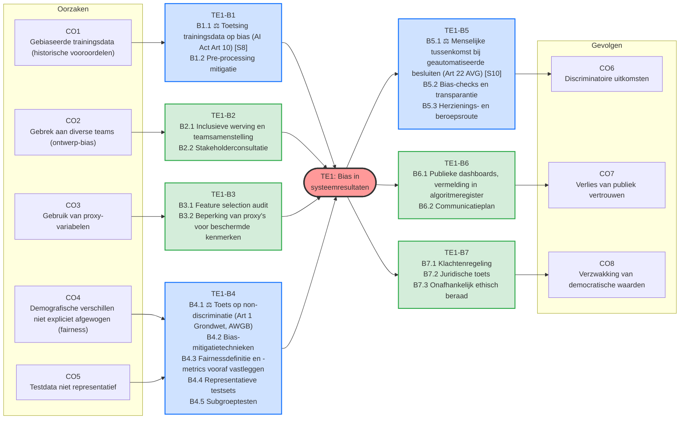
```mermaid
graph LR
    classDef legal fill:#cfe2ff,stroke:#0d6efd,stroke-width:2px
    classDef legalp fill:#e8f1ff,stroke:#0d6efd,stroke-width:2px,stroke-dasharray:5 3
    classDef bar fill:#d4edda,stroke:#28a745,stroke-width:2px
    classDef te fill:#ff9999,stroke:#333,stroke-width:3px
    classDef teref fill:#ffe0e0,stroke:#c00,stroke-width:2px,stroke-dasharray:4 3

    subgraph Oorzaken
        CO1["CO1<br/>Gebiaseerde trainingsdata (historische vooroordelen)"]
        CO2["CO2<br/>Gebrek aan diverse teams (ontwerp-bias)"]
        CO3["CO3<br/>Gebruik van proxy-variabelen"]
        CO4["CO4<br/>Demografische verschillen niet expliciet afgewogen (fairness)"]
        CO5["CO5<br/>Testdata niet representatief"]
    end

    TE1(["TE1: Bias in<br/>systeemresultaten"]):::te

    subgraph Gevolgen
        CO6["CO6<br/>Discriminatoire uitkomsten"]
        CO7["CO7<br/>Verlies van publiek vertrouwen"]
        CO8["CO8<br/>Verzwakking van democratische waarden"]
    end

    T1B1["TE1-B1<br/>B1.1 ⚖ Toetsing trainingsdata op bias (AI Act Art 10) [S8]<br/>B1.2 Pre-processing mitigatie"]:::legal
    T1B2["TE1-B2<br/>B2.1 Inclusieve werving en teamsamenstelling<br/>B2.2 Stakeholderconsultatie"]:::bar
    T1B3["TE1-B3<br/>B3.1 Feature selection audit<br/>B3.2 Beperking van proxy's voor beschermde kenmerken"]:::bar
    T1B4["TE1-B4<br/>B4.1 ⚖ Toets op non-discriminatie (Art 1 Grondwet, AWGB)<br/>B4.2 Bias-mitigatietechnieken<br/>B4.3 Fairnessdefinitie en -metrics vooraf vastleggen<br/>B4.4 Representatieve testsets<br/>B4.5 Subgroeptesten"]:::legal
    T1B5["TE1-B5<br/>B5.1 ⚖ Menselijke tussenkomst bij geautomatiseerde besluiten (Art 22 AVG) [S10]<br/>B5.2 Bias-checks en transparantie<br/>B5.3 Herzienings- en beroepsroute"]:::legal
    T1B6["TE1-B6<br/>B6.1 Publieke dashboards, vermelding in algoritmeregister<br/>B6.2 Communicatieplan"]:::bar
    T1B7["TE1-B7<br/>B7.1 Klachtenregeling<br/>B7.2 Juridische toets<br/>B7.3 Onafhankelijk ethisch beraad"]:::bar

    CO1 --> T1B1
    T1B1 --> TE1
    CO2 --> T1B2
    T1B2 --> TE1
    CO3 --> T1B3
    T1B3 --> TE1
    CO4 --> T1B4
    T1B4 --> TE1
    CO5 --> T1B4
    TE1 --> T1B5
    T1B5 --> CO6
    TE1 --> T1B6
    T1B6 --> CO7
    TE1 --> T1B7
    T1B7 --> CO8
```

## TE2: Niet-accuraat systeemfunctioneren
*Het systeem maakt foutieve voorspellingen of classificaties (niet-generatief).*
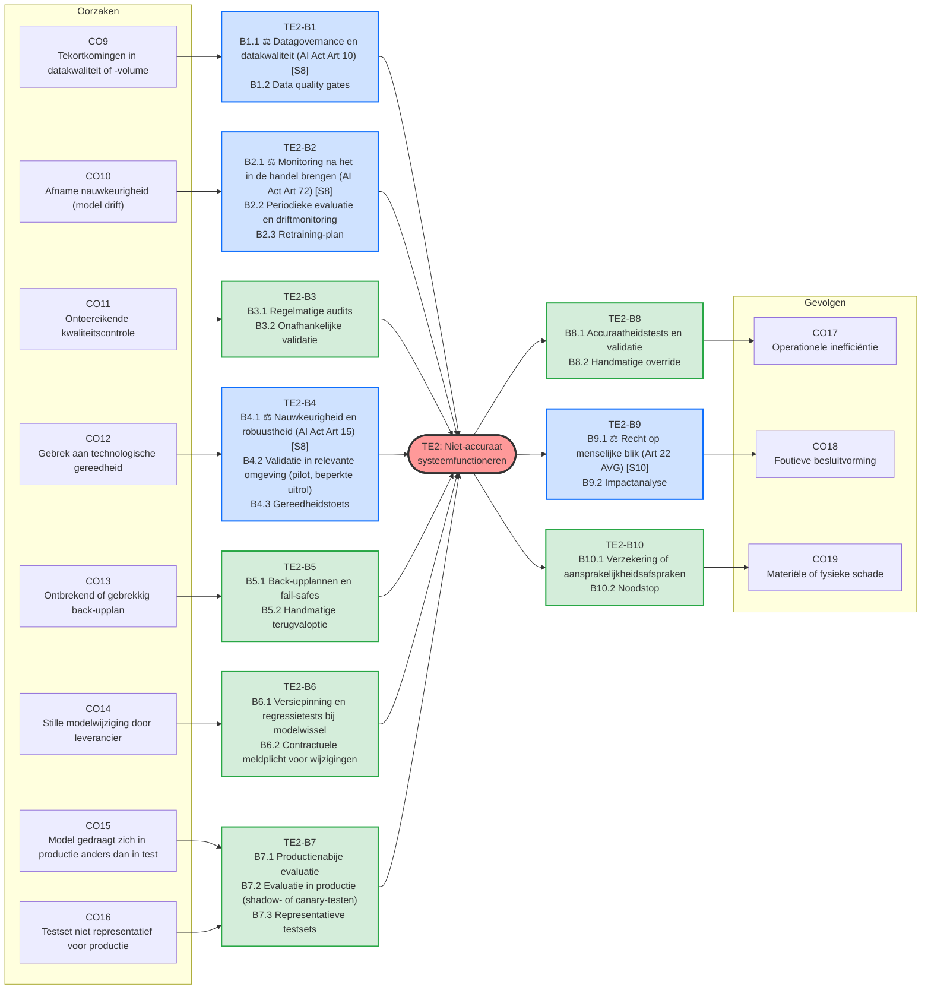
```mermaid
graph LR
    classDef legal fill:#cfe2ff,stroke:#0d6efd,stroke-width:2px
    classDef legalp fill:#e8f1ff,stroke:#0d6efd,stroke-width:2px,stroke-dasharray:5 3
    classDef bar fill:#d4edda,stroke:#28a745,stroke-width:2px
    classDef te fill:#ff9999,stroke:#333,stroke-width:3px
    classDef teref fill:#ffe0e0,stroke:#c00,stroke-width:2px,stroke-dasharray:4 3

    subgraph Oorzaken
        CO9["CO9<br/>Tekortkomingen in datakwaliteit of -volume"]
        CO10["CO10<br/>Afname nauwkeurigheid (model drift)"]
        CO11["CO11<br/>Ontoereikende kwaliteitscontrole"]
        CO12["CO12<br/>Gebrek aan technologische gereedheid"]
        CO13["CO13<br/>Ontbrekend of gebrekkig back-upplan"]
        CO14["CO14<br/>Stille modelwijziging door leverancier"]
        CO15["CO15<br/>Model gedraagt zich in productie anders dan in test"]
        CO16["CO16<br/>Testset niet representatief voor productie"]
    end

    TE2(["TE2: Niet-accuraat<br/>systeemfunctioneren"]):::te

    subgraph Gevolgen
        CO17["CO17<br/>Operationele inefficiëntie"]
        CO18["CO18<br/>Foutieve besluitvorming"]
        CO19["CO19<br/>Materiële of fysieke schade"]
    end

    T2B1["TE2-B1<br/>B1.1 ⚖ Datagovernance en datakwaliteit (AI Act Art 10) [S8]<br/>B1.2 Data quality gates"]:::legal
    T2B2["TE2-B2<br/>B2.1 ⚖ Monitoring na het in de handel brengen (AI Act Art 72) [S8]<br/>B2.2 Periodieke evaluatie en driftmonitoring<br/>B2.3 Retraining-plan"]:::legal
    T2B3["TE2-B3<br/>B3.1 Regelmatige audits<br/>B3.2 Onafhankelijke validatie"]:::bar
    T2B4["TE2-B4<br/>B4.1 ⚖ Nauwkeurigheid en robuustheid (AI Act Art 15) [S8]<br/>B4.2 Validatie in relevante omgeving (pilot, beperkte uitrol)<br/>B4.3 Gereedheidstoets"]:::legal
    T2B5["TE2-B5<br/>B5.1 Back-upplannen en fail-safes<br/>B5.2 Handmatige terugvaloptie"]:::bar
    T2B6["TE2-B6<br/>B6.1 Versiepinning en regressietests bij modelwissel<br/>B6.2 Contractuele meldplicht voor wijzigingen"]:::bar
    T2B7["TE2-B7<br/>B7.1 Productienabije evaluatie<br/>B7.2 Evaluatie in productie (shadow- of canary-testen)<br/>B7.3 Representatieve testsets"]:::bar
    T2B8["TE2-B8<br/>B8.1 Accuraatheidstests en validatie<br/>B8.2 Handmatige override"]:::bar
    T2B9["TE2-B9<br/>B9.1 ⚖ Recht op menselijke blik (Art 22 AVG) [S10]<br/>B9.2 Impactanalyse"]:::legal
    T2B10["TE2-B10<br/>B10.1 Verzekering of aansprakelijkheidsafspraken<br/>B10.2 Noodstop"]:::bar

    CO9 --> T2B1
    T2B1 --> TE2
    CO10 --> T2B2
    T2B2 --> TE2
    CO11 --> T2B3
    T2B3 --> TE2
    CO12 --> T2B4
    T2B4 --> TE2
    CO13 --> T2B5
    T2B5 --> TE2
    CO14 --> T2B6
    T2B6 --> TE2
    CO15 --> T2B7
    T2B7 --> TE2
    CO16 --> T2B7
    TE2 --> T2B8
    T2B8 --> CO17
    TE2 --> T2B9
    T2B9 --> CO18
    TE2 --> T2B10
    T2B10 --> CO19
```

## TE3: Gegevensbeschermings-niet-naleving (privacy)
*Risico's bij de verwerking van persoonsgegevens (AVG-focus).*
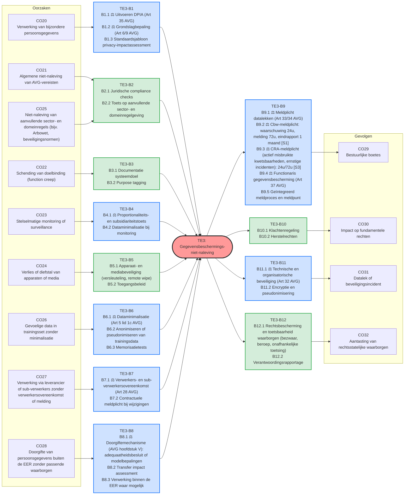
```mermaid
graph LR
    classDef legal fill:#cfe2ff,stroke:#0d6efd,stroke-width:2px
    classDef legalp fill:#e8f1ff,stroke:#0d6efd,stroke-width:2px,stroke-dasharray:5 3
    classDef bar fill:#d4edda,stroke:#28a745,stroke-width:2px
    classDef te fill:#ff9999,stroke:#333,stroke-width:3px
    classDef teref fill:#ffe0e0,stroke:#c00,stroke-width:2px,stroke-dasharray:4 3

    subgraph Oorzaken
        CO20["CO20<br/>Verwerking van bijzondere persoonsgegevens"]
        CO21["CO21<br/>Algemene niet-naleving van AVG-vereisten"]
        CO22["CO22<br/>Schending van doelbinding (function creep)"]
        CO23["CO23<br/>Stelselmatige monitoring of surveillance"]
        CO24["CO24<br/>Verlies of diefstal van apparaten of media"]
        CO25["CO25<br/>Niet-naleving van aanvullende sector- en domeinregels (bijv. Arbowet, beveiligingsnormen)"]
        CO26["CO26<br/>Gevoelige data in trainingsset zonder minimalisatie"]
        CO27["CO27<br/>Verwerking via leverancier of sub-verwerkers zonder verwerkersovereenkomst of melding"]
        CO28["CO28<br/>Doorgifte van persoonsgegevens buiten de EER zonder passende waarborgen"]
    end

    TE3(["TE3: Gegevensbeschermings-<br/>niet-naleving"]):::te

    subgraph Gevolgen
        CO29["CO29<br/>Bestuurlijke boetes"]
        CO30["CO30<br/>Impact op fundamentele rechten"]
        CO31["CO31<br/>Datalek of beveiligingsincident"]
        CO32["CO32<br/>Aantasting van rechtsstatelijke waarborgen"]
    end

    T3B1["TE3-B1<br/>B1.1 ⚖ Uitvoeren DPIA (Art 35 AVG)<br/>B1.2 ⚖ Grondslagbepaling (Art 6/9 AVG)<br/>B1.3 Standaardsjabloon privacy-impactassessment"]:::legal
    T3B2["TE3-B2<br/>B2.1 Juridische compliance checks<br/>B2.2 Toets op aanvullende sector- en domeinregelgeving"]:::bar
    T3B3["TE3-B3<br/>B3.1 Documentatie systeemdoel<br/>B3.2 Purpose tagging"]:::bar
    T3B4["TE3-B4<br/>B4.1 ⚖ Proportionaliteits- en subsidiariteitstoets<br/>B4.2 Dataminimalisatie bij monitoring"]:::legal
    T3B5["TE3-B5<br/>B5.1 Apparaat- en mediabeveiliging (versleuteling, remote wipe)<br/>B5.2 Toegangsbeleid"]:::bar
    T3B6["TE3-B6<br/>B6.1 ⚖ Dataminimalisatie (Art 5 lid 1c AVG)<br/>B6.2 Anonimiseren of pseudonimiseren van trainingsdata<br/>B6.3 Memorisatietests"]:::legal
    T3B7["TE3-B7<br/>B7.1 ⚖ Verwerkers- en sub-verwerkersovereenkomst (Art 28 AVG)<br/>B7.2 Contractuele meldplicht bij wijzigingen"]:::legal
    T3B8["TE3-B8<br/>B8.1 ⚖ Doorgiftemechanisme (AVG hoofdstuk V): adequaatheidsbesluit of modelbepalingen<br/>B8.2 Transfer impact assessment<br/>B8.3 Verwerking binnen de EER waar mogelijk"]:::legal
    T3B9["TE3-B9<br/>B9.1 ⚖ Meldplicht datalekken (Art 33/34 AVG)<br/>B9.2 ⚖ Cbw-meldplicht: waarschuwing 24u, melding 72u, eindrapport 1 maand [S1]<br/>B9.3 ⚖ CRA-meldplicht (actief misbruikte kwetsbaarheden, ernstige incidenten): 24u/72u [S3]<br/>B9.4 ⚖ Functionaris gegevensbescherming (Art 37 AVG)<br/>B9.5 Geïntegreerd meldproces en meldpunt"]:::legal
    T3B10["TE3-B10<br/>B10.1 Klachtenregeling<br/>B10.2 Herstelrechten"]:::bar
    T3B11["TE3-B11<br/>B11.1 ⚖ Technische en organisatorische beveiliging (Art 32 AVG)<br/>B11.2 Encryptie en pseudonimisering"]:::legal
    T3B12["TE3-B12<br/>B12.1 Rechtsbescherming en toetsbaarheid waarborgen (bezwaar, beroep, onafhankelijke toetsing)<br/>B12.2 Verantwoordingsrapportage"]:::bar

    CO20 --> T3B1
    T3B1 --> TE3
    CO21 --> T3B2
    T3B2 --> TE3
    CO22 --> T3B3
    T3B3 --> TE3
    CO23 --> T3B4
    T3B4 --> TE3
    CO24 --> T3B5
    T3B5 --> TE3
    CO25 --> T3B2
    CO26 --> T3B6
    T3B6 --> TE3
    CO27 --> T3B7
    T3B7 --> TE3
    CO28 --> T3B8
    T3B8 --> TE3
    TE3 --> T3B9
    T3B9 --> CO29
    TE3 --> T3B10
    T3B10 --> CO30
    TE3 --> T3B11
    T3B11 --> CO31
    TE3 --> T3B12
    T3B12 --> CO32
```

## TE4: AI-toepassing in hoogrisicoscenario's
*Systemen die onder de hoogrisicodefinitie van de AI Act vallen. Voorwaardelijk (S8).*
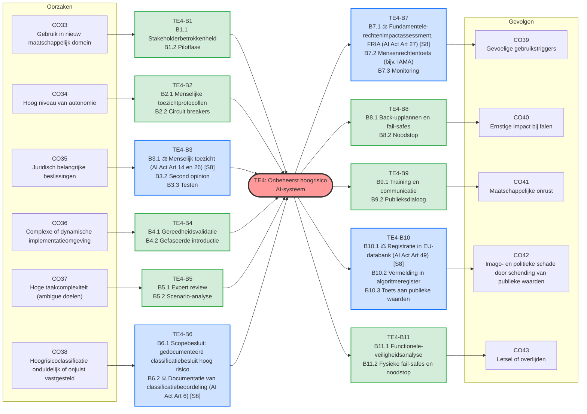
```mermaid
graph LR
    classDef legal fill:#cfe2ff,stroke:#0d6efd,stroke-width:2px
    classDef legalp fill:#e8f1ff,stroke:#0d6efd,stroke-width:2px,stroke-dasharray:5 3
    classDef bar fill:#d4edda,stroke:#28a745,stroke-width:2px
    classDef te fill:#ff9999,stroke:#333,stroke-width:3px
    classDef teref fill:#ffe0e0,stroke:#c00,stroke-width:2px,stroke-dasharray:4 3

    subgraph Oorzaken
        CO33["CO33<br/>Gebruik in nieuw maatschappelijk domein"]
        CO34["CO34<br/>Hoog niveau van autonomie"]
        CO35["CO35<br/>Juridisch belangrijke beslissingen"]
        CO36["CO36<br/>Complexe of dynamische implementatieomgeving"]
        CO37["CO37<br/>Hoge taakcomplexiteit (ambigue doelen)"]
        CO38["CO38<br/>Hoogrisicoclassificatie onduidelijk of onjuist vastgesteld"]
    end

    TE4(["TE4: Onbeheerst hoogrisico<br/>AI-systeem"]):::te

    subgraph Gevolgen
        CO39["CO39<br/>Gevoelige gebruikstriggers"]
        CO40["CO40<br/>Ernstige impact bij falen"]
        CO41["CO41<br/>Maatschappelijke onrust"]
        CO42["CO42<br/>Imago- en politieke schade door schending van publieke waarden"]
        CO43["CO43<br/>Letsel of overlijden"]
    end

    T4B1["TE4-B1<br/>B1.1 Stakeholderbetrokkenheid<br/>B1.2 Pilotfase"]:::bar
    T4B2["TE4-B2<br/>B2.1 Menselijke toezichtprotocollen<br/>B2.2 Circuit breakers"]:::bar
    T4B3["TE4-B3<br/>B3.1 ⚖ Menselijk toezicht (AI Act Art 14 en 26) [S8]<br/>B3.2 Second opinion<br/>B3.3 Testen"]:::legal
    T4B4["TE4-B4<br/>B4.1 Gereedheidsvalidatie<br/>B4.2 Gefaseerde introductie"]:::bar
    T4B5["TE4-B5<br/>B5.1 Expert review<br/>B5.2 Scenario-analyse"]:::bar
    T4B6["TE4-B6<br/>B6.1 Scopebesluit: gedocumenteerd classificatiebesluit hoog risico<br/>B6.2 ⚖ Documentatie van classificatiebeoordeling (AI Act Art 6) [S8]"]:::legal
    T4B7["TE4-B7<br/>B7.1 ⚖ Fundamentele-rechtenimpactassessment, FRIA (AI Act Art 27) [S8]<br/>B7.2 Mensenrechtentoets (bijv. IAMA)<br/>B7.3 Monitoring"]:::legal
    T4B8["TE4-B8<br/>B8.1 Back-upplannen en fail-safes<br/>B8.2 Noodstop"]:::bar
    T4B9["TE4-B9<br/>B9.1 Training en communicatie<br/>B9.2 Publieksdialoog"]:::bar
    T4B10["TE4-B10<br/>B10.1 ⚖ Registratie in EU-databank (AI Act Art 49) [S8]<br/>B10.2 Vermelding in algoritmeregister<br/>B10.3 Toets aan publieke waarden"]:::legal
    T4B11["TE4-B11<br/>B11.1 Functionele-veiligheidsanalyse<br/>B11.2 Fysieke fail-safes en noodstop"]:::bar

    CO33 --> T4B1
    T4B1 --> TE4
    CO34 --> T4B2
    T4B2 --> TE4
    CO35 --> T4B3
    T4B3 --> TE4
    CO36 --> T4B4
    T4B4 --> TE4
    CO37 --> T4B5
    T4B5 --> TE4
    CO38 --> T4B6
    T4B6 --> TE4
    TE4 --> T4B7
    T4B7 --> CO39
    TE4 --> T4B8
    T4B8 --> CO40
    TE4 --> T4B9
    T4B9 --> CO41
    TE4 --> T4B10
    T4B10 --> CO42
    TE4 --> T4B11
    T4B11 --> CO43
```

## TE5: Geen transparantie en uitlegbaarheid
*Het 'black box'-probleem.*
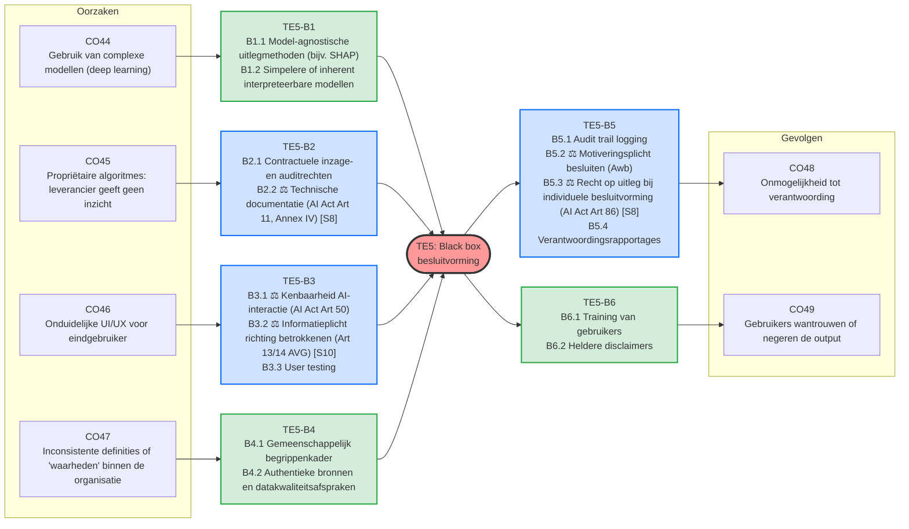
```mermaid
graph LR
    classDef legal fill:#cfe2ff,stroke:#0d6efd,stroke-width:2px
    classDef legalp fill:#e8f1ff,stroke:#0d6efd,stroke-width:2px,stroke-dasharray:5 3
    classDef bar fill:#d4edda,stroke:#28a745,stroke-width:2px
    classDef te fill:#ff9999,stroke:#333,stroke-width:3px
    classDef teref fill:#ffe0e0,stroke:#c00,stroke-width:2px,stroke-dasharray:4 3

    subgraph Oorzaken
        CO44["CO44<br/>Gebruik van complexe modellen (deep learning)"]
        CO45["CO45<br/>Propriëtaire algoritmes: leverancier geeft geen inzicht"]
        CO46["CO46<br/>Onduidelijke UI/UX voor eindgebruiker"]
        CO47["CO47<br/>Inconsistente definities of 'waarheden' binnen de organisatie"]
    end

    TE5(["TE5: Black box<br/>besluitvorming"]):::te

    subgraph Gevolgen
        CO48["CO48<br/>Onmogelijkheid tot verantwoording"]
        CO49["CO49<br/>Gebruikers wantrouwen of negeren de output"]
    end

    T5B1["TE5-B1<br/>B1.1 Model-agnostische uitlegmethoden (bijv. SHAP)<br/>B1.2 Simpelere of inherent interpreteerbare modellen"]:::bar
    T5B2["TE5-B2<br/>B2.1 Contractuele inzage- en auditrechten<br/>B2.2 ⚖ Technische documentatie (AI Act Art 11, Annex IV) [S8]"]:::legal
    T5B3["TE5-B3<br/>B3.1 ⚖ Kenbaarheid AI-interactie (AI Act Art 50)<br/>B3.2 ⚖ Informatieplicht richting betrokkenen (Art 13/14 AVG) [S10]<br/>B3.3 User testing"]:::legal
    T5B4["TE5-B4<br/>B4.1 Gemeenschappelijk begrippenkader<br/>B4.2 Authentieke bronnen en datakwaliteitsafspraken"]:::bar
    T5B5["TE5-B5<br/>B5.1 Audit trail logging<br/>B5.2 ⚖ Motiveringsplicht besluiten (Awb)<br/>B5.3 ⚖ Recht op uitleg bij individuele besluitvorming (AI Act Art 86) [S8]<br/>B5.4 Verantwoordingsrapportages"]:::legal
    T5B6["TE5-B6<br/>B6.1 Training van gebruikers<br/>B6.2 Heldere disclaimers"]:::bar

    CO44 --> T5B1
    T5B1 --> TE5
    CO45 --> T5B2
    T5B2 --> TE5
    CO46 --> T5B3
    T5B3 --> TE5
    CO47 --> T5B4
    T5B4 --> TE5
    TE5 --> T5B5
    T5B5 --> CO48
    TE5 --> T5B6
    T5B6 --> CO49
```

## TE6: Geen menselijk toezicht (human oversight)
*Automatisering op de automatische piloot.*
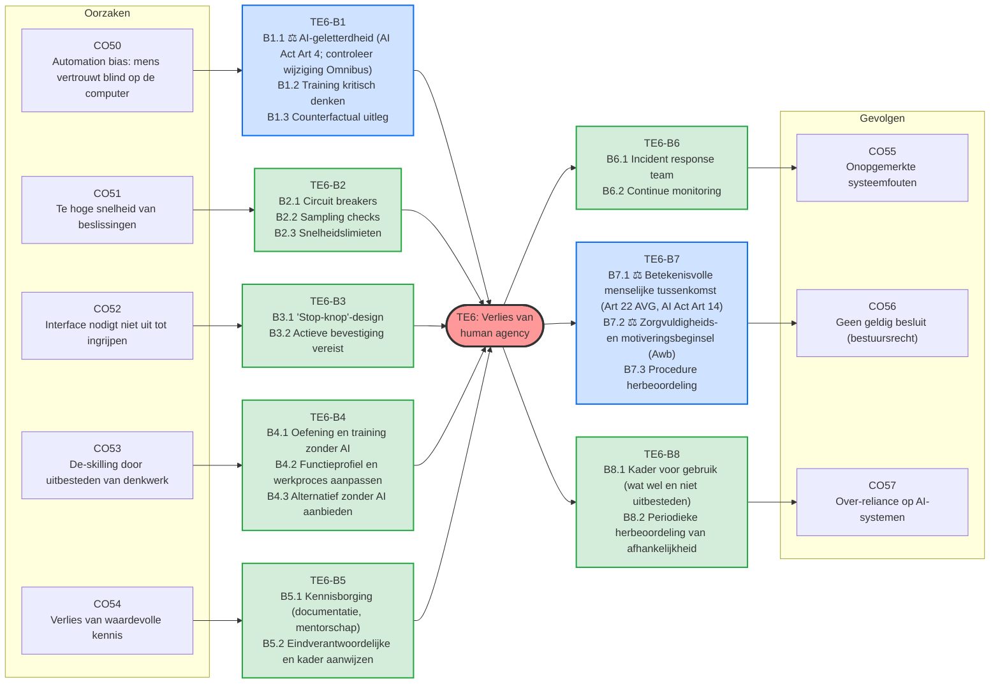
```mermaid
graph LR
    classDef legal fill:#cfe2ff,stroke:#0d6efd,stroke-width:2px
    classDef legalp fill:#e8f1ff,stroke:#0d6efd,stroke-width:2px,stroke-dasharray:5 3
    classDef bar fill:#d4edda,stroke:#28a745,stroke-width:2px
    classDef te fill:#ff9999,stroke:#333,stroke-width:3px
    classDef teref fill:#ffe0e0,stroke:#c00,stroke-width:2px,stroke-dasharray:4 3

    subgraph Oorzaken
        CO50["CO50<br/>Automation bias: mens vertrouwt blind op de computer"]
        CO51["CO51<br/>Te hoge snelheid van beslissingen"]
        CO52["CO52<br/>Interface nodigt niet uit tot ingrijpen"]
        CO53["CO53<br/>De-skilling door uitbesteden van denkwerk"]
        CO54["CO54<br/>Verlies van waardevolle kennis"]
    end

    TE6(["TE6: Verlies van<br/>human agency"]):::te

    subgraph Gevolgen
        CO55["CO55<br/>Onopgemerkte systeemfouten"]
        CO56["CO56<br/>Geen geldig besluit (bestuursrecht)"]
        CO57["CO57<br/>Over-reliance op AI-systemen"]
    end

    T6B1["TE6-B1<br/>B1.1 ⚖ AI-geletterdheid (AI Act Art 4; controleer wijziging Omnibus)<br/>B1.2 Training kritisch denken<br/>B1.3 Counterfactual uitleg"]:::legal
    T6B2["TE6-B2<br/>B2.1 Circuit breakers<br/>B2.2 Sampling checks<br/>B2.3 Snelheidslimieten"]:::bar
    T6B3["TE6-B3<br/>B3.1 'Stop-knop'-design<br/>B3.2 Actieve bevestiging vereist"]:::bar
    T6B4["TE6-B4<br/>B4.1 Oefening en training zonder AI<br/>B4.2 Functieprofiel en werkproces aanpassen<br/>B4.3 Alternatief zonder AI aanbieden"]:::bar
    T6B5["TE6-B5<br/>B5.1 Kennisborging (documentatie, mentorschap)<br/>B5.2 Eindverantwoordelijke en kader aanwijzen"]:::bar
    T6B6["TE6-B6<br/>B6.1 Incident response team<br/>B6.2 Continue monitoring"]:::bar
    T6B7["TE6-B7<br/>B7.1 ⚖ Betekenisvolle menselijke tussenkomst (Art 22 AVG, AI Act Art 14)<br/>B7.2 ⚖ Zorgvuldigheids- en motiveringsbeginsel (Awb)<br/>B7.3 Procedure herbeoordeling"]:::legal
    T6B8["TE6-B8<br/>B8.1 Kader voor gebruik (wat wel en niet uitbesteden)<br/>B8.2 Periodieke herbeoordeling van afhankelijkheid"]:::bar

    CO50 --> T6B1
    T6B1 --> TE6
    CO51 --> T6B2
    T6B2 --> TE6
    CO52 --> T6B3
    T6B3 --> TE6
    CO53 --> T6B4
    T6B4 --> TE6
    CO54 --> T6B5
    T6B5 --> TE6
    TE6 --> T6B6
    T6B6 --> CO55
    TE6 --> T6B7
    T6B7 --> CO56
    TE6 --> T6B8
    T6B8 --> CO57
```

## TE7: Nadelen voor stakeholders
*Economische of sociale schade, breder dan discriminatie.*
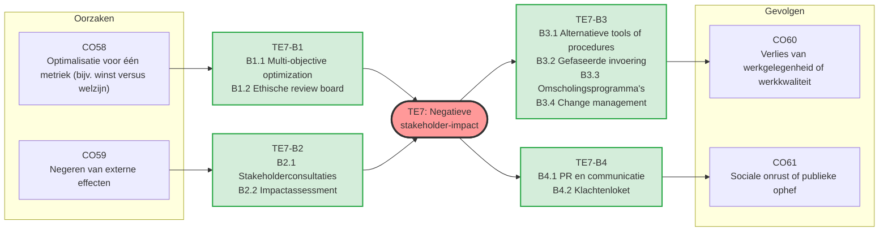
```mermaid
graph LR
    classDef legal fill:#cfe2ff,stroke:#0d6efd,stroke-width:2px
    classDef legalp fill:#e8f1ff,stroke:#0d6efd,stroke-width:2px,stroke-dasharray:5 3
    classDef bar fill:#d4edda,stroke:#28a745,stroke-width:2px
    classDef te fill:#ff9999,stroke:#333,stroke-width:3px
    classDef teref fill:#ffe0e0,stroke:#c00,stroke-width:2px,stroke-dasharray:4 3

    subgraph Oorzaken
        CO58["CO58<br/>Optimalisatie voor één metriek (bijv. winst versus welzijn)"]
        CO59["CO59<br/>Negeren van externe effecten"]
    end

    TE7(["TE7: Negatieve<br/>stakeholder-impact"]):::te

    subgraph Gevolgen
        CO60["CO60<br/>Verlies van werkgelegenheid of werkkwaliteit"]
        CO61["CO61<br/>Sociale onrust of publieke ophef"]
    end

    T7B1["TE7-B1<br/>B1.1 Multi-objective optimization<br/>B1.2 Ethische review board"]:::bar
    T7B2["TE7-B2<br/>B2.1 Stakeholderconsultaties<br/>B2.2 Impactassessment"]:::bar
    T7B3["TE7-B3<br/>B3.1 Alternatieve tools of procedures<br/>B3.2 Gefaseerde invoering<br/>B3.3 Omscholingsprogramma's<br/>B3.4 Change management"]:::bar
    T7B4["TE7-B4<br/>B4.1 PR en communicatie<br/>B4.2 Klachtenloket"]:::bar

    CO58 --> T7B1
    T7B1 --> TE7
    CO59 --> T7B2
    T7B2 --> TE7
    TE7 --> T7B3
    T7B3 --> CO60
    TE7 --> T7B4
    T7B4 --> CO61
```

## TE8: Onbedoelde gevolgen (side effects)
*Het 'Sorcerer's Apprentice'-effect.*
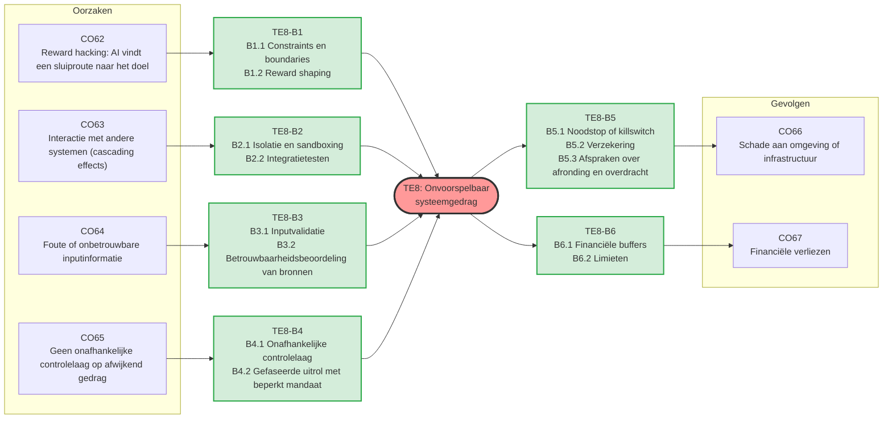
```mermaid
graph LR
    classDef legal fill:#cfe2ff,stroke:#0d6efd,stroke-width:2px
    classDef legalp fill:#e8f1ff,stroke:#0d6efd,stroke-width:2px,stroke-dasharray:5 3
    classDef bar fill:#d4edda,stroke:#28a745,stroke-width:2px
    classDef te fill:#ff9999,stroke:#333,stroke-width:3px
    classDef teref fill:#ffe0e0,stroke:#c00,stroke-width:2px,stroke-dasharray:4 3

    subgraph Oorzaken
        CO62["CO62<br/>Reward hacking: AI vindt een sluiproute naar het doel"]
        CO63["CO63<br/>Interactie met andere systemen (cascading effects)"]
        CO64["CO64<br/>Foute of onbetrouwbare inputinformatie"]
        CO65["CO65<br/>Geen onafhankelijke controlelaag op afwijkend gedrag"]
    end

    TE8(["TE8: Onvoorspelbaar<br/>systeemgedrag"]):::te

    subgraph Gevolgen
        CO66["CO66<br/>Schade aan omgeving of infrastructuur"]
        CO67["CO67<br/>Financiële verliezen"]
    end

    T8B1["TE8-B1<br/>B1.1 Constraints en boundaries<br/>B1.2 Reward shaping"]:::bar
    T8B2["TE8-B2<br/>B2.1 Isolatie en sandboxing<br/>B2.2 Integratietesten"]:::bar
    T8B3["TE8-B3<br/>B3.1 Inputvalidatie<br/>B3.2 Betrouwbaarheidsbeoordeling van bronnen"]:::bar
    T8B4["TE8-B4<br/>B4.1 Onafhankelijke controlelaag<br/>B4.2 Gefaseerde uitrol met beperkt mandaat"]:::bar
    T8B5["TE8-B5<br/>B5.1 Noodstop of killswitch<br/>B5.2 Verzekering<br/>B5.3 Afspraken over afronding en overdracht"]:::bar
    T8B6["TE8-B6<br/>B6.1 Financiële buffers<br/>B6.2 Limieten"]:::bar

    CO62 --> T8B1
    T8B1 --> TE8
    CO63 --> T8B2
    T8B2 --> TE8
    CO64 --> T8B3
    T8B3 --> TE8
    CO65 --> T8B4
    T8B4 --> TE8
    TE8 --> T8B5
    T8B5 --> CO66
    TE8 --> T8B6
    T8B6 --> CO67
```

## TE9: Onbeveiligde data en systemen (security)
*Informatiebeveiligingsrisico's, specifiek voor AI.*

```mermaid
graph LR
    classDef legal fill:#cfe2ff,stroke:#0d6efd,stroke-width:2px
    classDef legalp fill:#e8f1ff,stroke:#0d6efd,stroke-width:2px,stroke-dasharray:5 3
    classDef bar fill:#d4edda,stroke:#28a745,stroke-width:2px
    classDef te fill:#ff9999,stroke:#333,stroke-width:3px
    classDef teref fill:#ffe0e0,stroke:#c00,stroke-width:2px,stroke-dasharray:4 3

    subgraph Oorzaken
        CO68["CO68<br/>Model inversion attacks (trainingsdata uit het model halen)"]
        CO69["CO69<br/>Adversarial examples (inputmanipulatie)"]
        CO70["CO70<br/>Onveilige API's of interfaces"]
        CO71["CO71<br/>Social engineering"]
        CO24["CO24<br/>Verlies of diefstal van apparaten of media"]
        CO72["CO72<br/>Compromittering van de toeleveringsketen (repo, model, dataset, dependency, tool-server)"]
        CO73["CO73<br/>Kwaadwillige exploits"]
        CO74["CO74<br/>Opzettelijke vergiftiging (poisoning) van trainings-, fine-tuning- of retrievaldata"]
        CO75["CO75<br/>Gevoelige informatie of credentials in systeemprompt of context"]
        CO76["CO76<br/>Onvoldoende scheiding of toegangscontrole in vector- en retrievalopslag [S6]"]
        CO77["CO77<br/>Onveilige of ongereviewde AI-gegenereerde code [S7]"]
        CO78["CO78<br/>Gehallucineerde of kwetsbare dependencies"]
        CO79["CO79<br/>Gemanipuleerde modelartefacten (backdoor, onveilig serialisatieformaat)"]
        CO80["CO80<br/>Niet-geautoriseerde applicatie of client krijgt toegang tot het model of de inference-engine"]
        CO81["CO81<br/>Publicatie van code, prompts of configuratie maakt kwetsbaarheden of gevoelige informatie openbaar [S11]"]
    end

    TE9(["TE9: Compromittering<br/>AI-model, -data of -code"]):::te

    subgraph Gevolgen
        CO82["CO82<br/>Diefstal van intellectueel eigendom"]
        CO83["CO83<br/>Manipulatie van output"]
        CO84["CO84<br/>Onherstelbare blootstelling door toekomstige cryptanalyse (bijv. quantum)"]
        CO85["CO85<br/>Onjuiste of onrechtmatige besluiten over burgers door gemanipuleerd model of data"]
    end

    T9B1["TE9-B1<br/>B1.1 Differential privacy<br/>B1.2 Beperken outputprecisie"]:::bar
    T9B2["TE9-B2<br/>B2.1 Adversarial training<br/>B2.2 Input sanitization"]:::bar
    T9B3["TE9-B3<br/>B3.1 ⚖ Beveiliging conform stand van de techniek (Art 32 AVG)<br/>B3.2 ⚖ Cbw-zorgplicht [S1]<br/>B3.3 ⚖ CRA: security by design en by default [S3]<br/>B3.4 Authenticatie en RBAC"]:::legal
    T9B4["TE9-B4<br/>B4.1 Zero-trust<br/>B4.2 Encryptie<br/>B4.3 Ephemeral omgevingen<br/>B4.4 Phishing-resistente authenticatie<br/>B4.5 Awareness"]:::bar
    T9B5["TE9-B5<br/>B5.1 Alleen ondertekende of gepinde componenten<br/>B5.2 Lokale kopie<br/>B5.3 Checksums bij installatie<br/>B5.4 Componenteninventaris (SBOM) als verantwoording [S3]<br/>B5.5 ⚖? CADA: transparantie toeleveringsketen, niveau 2 en hoger [S4]"]:::legalp
    T9B6["TE9-B6<br/>B6.1 ⚖ CRA: kwetsbaarhedenbeheer, coordinated-disclosurebeleid, beveiligingsupdates in de ondersteuningsperiode [S3]<br/>B6.2 Virtual patching<br/>B6.3 Patch-SLA"]:::legal
    T9B7["TE9-B7<br/>B7.1 Herkomst- en integriteitscontrole van data (lineage)<br/>B7.2 Toegangsbeperking op data"]:::bar
    T9B8["TE9-B8<br/>B8.1 Geen geheimen of credentials in prompt of context<br/>B8.2 Scheiding van geheimen"]:::bar
    T9B9["TE9-B9<br/>B9.1 Toegangscontrole en ingestiesanering op vectoropslag"]:::bar
    T9B10["TE9-B10<br/>B10.1 ⚖ CRA: veilige ontwikkeling [S3]<br/>B10.2 Veilige pijplijn voor gegenereerde code (review, SAST, tests)"]:::legal
    T9B11["TE9-B11<br/>B11.1 Dependencies verifiëren (allowlist, lockfiles)<br/>B11.2 Pakketbronnen beperken"]:::bar
    T9B12["TE9-B12<br/>B12.1 Quarantaine en verificatie van modelartefacten<br/>B12.2 Veilige formaten en handtekeningen"]:::bar
    T9B13["TE9-B13<br/>B13.1 Toegangsverificatie vóór inferentie (sleutel- of tokencontrole in proxy of shim)<br/>B13.2 Toegang tot de inference-engine alleen via een gateway<br/>B13.3 Alleen goedgekeurde uitvoeromgeving (beheerd apparaat)"]:::bar
    T9B14["TE9-B14<br/>B14.1 Review vóór publicatie (secret scanning, kwetsbaarhedentest)<br/>B14.2 Beheerdersproces voor kwetsbaarheidsmeldingen na publicatie [S3]"]:::bar
    T9B15["TE9-B15<br/>B15.1 Juridische stappen<br/>B15.2 Model watermarking<br/>B15.3 Rate limiting en query-monitoring"]:::bar
    T9B16["TE9-B16<br/>B16.1 Monitoring van afwijkingen<br/>B16.2 Rollback naar vorige versie"]:::bar
    T9B17["TE9-B17<br/>B17.1 Crypto-agility<br/>B17.2 Migratieplan naar post-quantum-cryptografie"]:::bar
    T9B18["TE9-B18<br/>B18.1 Herbeoordeling van getroffen besluiten<br/>B18.2 Herstel- en meldprocedure"]:::bar

    CO68 --> T9B1
    T9B1 --> TE9
    CO69 --> T9B2
    T9B2 --> TE9
    CO70 --> T9B3
    T9B3 --> TE9
    CO71 --> T9B4
    T9B4 --> TE9
    CO24 --> T9B4
    CO72 --> T9B5
    T9B5 --> TE9
    CO73 --> T9B6
    T9B6 --> TE9
    CO74 --> T9B7
    T9B7 --> TE9
    CO75 --> T9B8
    T9B8 --> TE9
    CO76 --> T9B9
    T9B9 --> TE9
    CO77 --> T9B10
    T9B10 --> TE9
    CO78 --> T9B11
    T9B11 --> TE9
    CO79 --> T9B12
    T9B12 --> TE9
    CO80 --> T9B13
    T9B13 --> TE9
    CO81 --> T9B14
    T9B14 --> TE9
    TE9 --> T9B15
    T9B15 --> CO82
    TE9 --> T9B16
    T9B16 --> CO83
    TE9 --> T9B17
    T9B17 --> CO84
    TE9 --> T9B18
    T9B18 --> CO85
```

## TE10: Mislukking halen ethische en juridische standaarden
*Bredere compliance en ethiek.*
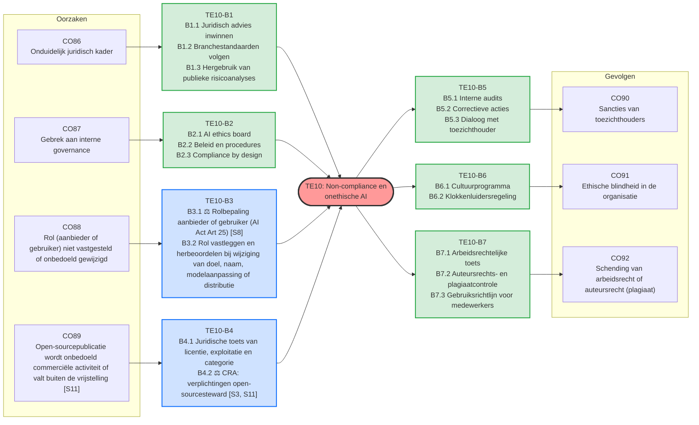
```mermaid
graph LR
    classDef legal fill:#cfe2ff,stroke:#0d6efd,stroke-width:2px
    classDef legalp fill:#e8f1ff,stroke:#0d6efd,stroke-width:2px,stroke-dasharray:5 3
    classDef bar fill:#d4edda,stroke:#28a745,stroke-width:2px
    classDef te fill:#ff9999,stroke:#333,stroke-width:3px
    classDef teref fill:#ffe0e0,stroke:#c00,stroke-width:2px,stroke-dasharray:4 3

    subgraph Oorzaken
        CO86["CO86<br/>Onduidelijk juridisch kader"]
        CO87["CO87<br/>Gebrek aan interne governance"]
        CO88["CO88<br/>Rol (aanbieder of gebruiker) niet vastgesteld of onbedoeld gewijzigd"]
        CO89["CO89<br/>Open-sourcepublicatie wordt onbedoeld commerciële activiteit of valt buiten de vrijstelling [S11]"]
    end

    TE10(["TE10: Non-compliance en<br/>onethische AI"]):::te

    subgraph Gevolgen
        CO90["CO90<br/>Sancties van toezichthouders"]
        CO91["CO91<br/>Ethische blindheid in de organisatie"]
        CO92["CO92<br/>Schending van arbeidsrecht of auteursrecht (plagiaat)"]
    end

    T10B1["TE10-B1<br/>B1.1 Juridisch advies inwinnen<br/>B1.2 Branchestandaarden volgen<br/>B1.3 Hergebruik van publieke risicoanalyses"]:::bar
    T10B2["TE10-B2<br/>B2.1 AI ethics board<br/>B2.2 Beleid en procedures<br/>B2.3 Compliance by design"]:::bar
    T10B3["TE10-B3<br/>B3.1 ⚖ Rolbepaling aanbieder of gebruiker (AI Act Art 25) [S8]<br/>B3.2 Rol vastleggen en herbeoordelen bij wijziging van doel, naam, modelaanpassing of distributie"]:::legal
    T10B4["TE10-B4<br/>B4.1 Juridische toets van licentie, exploitatie en categorie<br/>B4.2 ⚖ CRA: verplichtingen open-sourcesteward [S3, S11]"]:::legal
    T10B5["TE10-B5<br/>B5.1 Interne audits<br/>B5.2 Correctieve acties<br/>B5.3 Dialoog met toezichthouder"]:::bar
    T10B6["TE10-B6<br/>B6.1 Cultuurprogramma<br/>B6.2 Klokkenluidersregeling"]:::bar
    T10B7["TE10-B7<br/>B7.1 Arbeidsrechtelijke toets<br/>B7.2 Auteursrechts- en plagiaatcontrole<br/>B7.3 Gebruiksrichtlijn voor medewerkers"]:::bar

    CO86 --> T10B1
    T10B1 --> TE10
    CO87 --> T10B2
    T10B2 --> TE10
    CO88 --> T10B3
    T10B3 --> TE10
    CO89 --> T10B4
    T10B4 --> TE10
    TE10 --> T10B5
    T10B5 --> CO90
    TE10 --> T10B6
    T10B6 --> CO91
    TE10 --> T10B7
    T10B7 --> CO92
```

## TE11: Fairnessverstoringen
*Eerlijke verdeling; overlapt met TE-01 maar is breder.*
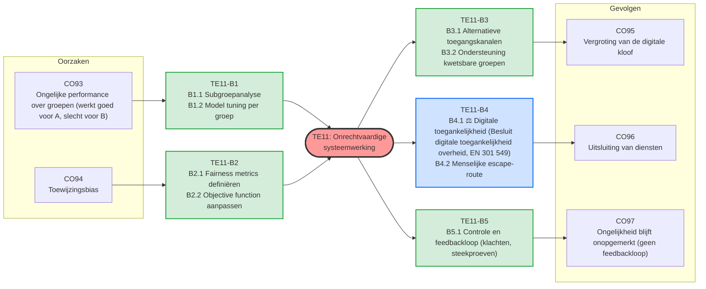
```mermaid
graph LR
    classDef legal fill:#cfe2ff,stroke:#0d6efd,stroke-width:2px
    classDef legalp fill:#e8f1ff,stroke:#0d6efd,stroke-width:2px,stroke-dasharray:5 3
    classDef bar fill:#d4edda,stroke:#28a745,stroke-width:2px
    classDef te fill:#ff9999,stroke:#333,stroke-width:3px
    classDef teref fill:#ffe0e0,stroke:#c00,stroke-width:2px,stroke-dasharray:4 3

    subgraph Oorzaken
        CO93["CO93<br/>Ongelijke performance over groepen (werkt goed voor A, slecht voor B)"]
        CO94["CO94<br/>Toewijzingsbias"]
    end

    TE11(["TE11: Onrechtvaardige<br/>systeemwerking"]):::te

    subgraph Gevolgen
        CO95["CO95<br/>Vergroting van de digitale kloof"]
        CO96["CO96<br/>Uitsluiting van diensten"]
        CO97["CO97<br/>Ongelijkheid blijft onopgemerkt (geen feedbackloop)"]
    end

    T11B1["TE11-B1<br/>B1.1 Subgroepanalyse<br/>B1.2 Model tuning per groep"]:::bar
    T11B2["TE11-B2<br/>B2.1 Fairness metrics definiëren<br/>B2.2 Objective function aanpassen"]:::bar
    T11B3["TE11-B3<br/>B3.1 Alternatieve toegangskanalen<br/>B3.2 Ondersteuning kwetsbare groepen"]:::bar
    T11B4["TE11-B4<br/>B4.1 ⚖ Digitale toegankelijkheid (Besluit digitale toegankelijkheid overheid, EN 301 549)<br/>B4.2 Menselijke escape-route"]:::legal
    T11B5["TE11-B5<br/>B5.1 Controle en feedbackloop (klachten, steekproeven)"]:::bar

    CO93 --> T11B1
    T11B1 --> TE11
    CO94 --> T11B2
    T11B2 --> TE11
    TE11 --> T11B3
    T11B3 --> CO95
    TE11 --> T11B4
    T11B4 --> CO96
    TE11 --> T11B5
    T11B5 --> CO97
```

## TE12: Algoritme misaligned met publieke waarden
*Clash met maatschappelijke normen.*
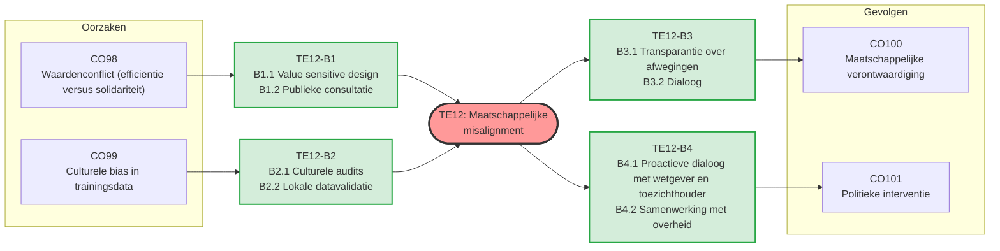
```mermaid
graph LR
    classDef legal fill:#cfe2ff,stroke:#0d6efd,stroke-width:2px
    classDef legalp fill:#e8f1ff,stroke:#0d6efd,stroke-width:2px,stroke-dasharray:5 3
    classDef bar fill:#d4edda,stroke:#28a745,stroke-width:2px
    classDef te fill:#ff9999,stroke:#333,stroke-width:3px
    classDef teref fill:#ffe0e0,stroke:#c00,stroke-width:2px,stroke-dasharray:4 3

    subgraph Oorzaken
        CO98["CO98<br/>Waardenconflict (efficiëntie versus solidariteit)"]
        CO99["CO99<br/>Culturele bias in trainingsdata"]
    end

    TE12(["TE12: Maatschappelijke<br/>misalignment"]):::te

    subgraph Gevolgen
        CO100["CO100<br/>Maatschappelijke verontwaardiging"]
        CO101["CO101<br/>Politieke interventie"]
    end

    T12B1["TE12-B1<br/>B1.1 Value sensitive design<br/>B1.2 Publieke consultatie"]:::bar
    T12B2["TE12-B2<br/>B2.1 Culturele audits<br/>B2.2 Lokale datavalidatie"]:::bar
    T12B3["TE12-B3<br/>B3.1 Transparantie over afwegingen<br/>B3.2 Dialoog"]:::bar
    T12B4["TE12-B4<br/>B4.1 Proactieve dialoog met wetgever en toezichthouder<br/>B4.2 Samenwerking met overheid"]:::bar

    CO98 --> T12B1
    T12B1 --> TE12
    CO99 --> T12B2
    T12B2 --> TE12
    TE12 --> T12B3
    T12B3 --> CO100
    TE12 --> T12B4
    T12B4 --> CO101
```

## TE13: Milieu-impact (ecologische voetafdruk)
*Duurzaamheid van AI.*
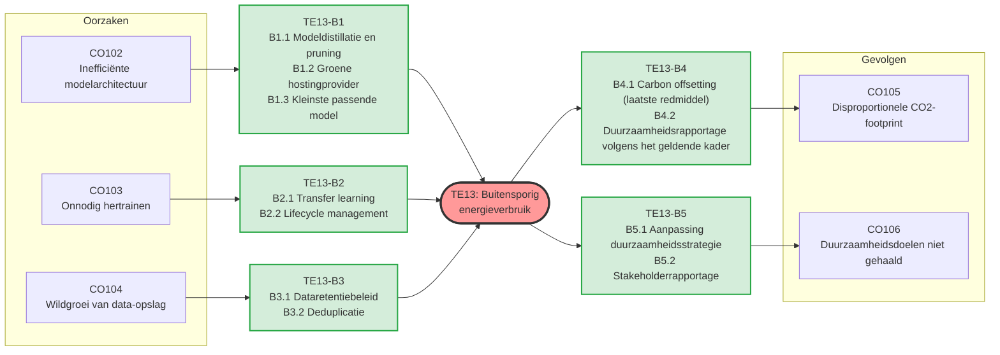
```mermaid
graph LR
    classDef legal fill:#cfe2ff,stroke:#0d6efd,stroke-width:2px
    classDef legalp fill:#e8f1ff,stroke:#0d6efd,stroke-width:2px,stroke-dasharray:5 3
    classDef bar fill:#d4edda,stroke:#28a745,stroke-width:2px
    classDef te fill:#ff9999,stroke:#333,stroke-width:3px
    classDef teref fill:#ffe0e0,stroke:#c00,stroke-width:2px,stroke-dasharray:4 3

    subgraph Oorzaken
        CO102["CO102<br/>Inefficiënte modelarchitectuur"]
        CO103["CO103<br/>Onnodig hertrainen"]
        CO104["CO104<br/>Wildgroei van data-opslag"]
    end

    TE13(["TE13: Buitensporig<br/>energieverbruik"]):::te

    subgraph Gevolgen
        CO105["CO105<br/>Disproportionele CO2-footprint"]
        CO106["CO106<br/>Duurzaamheidsdoelen niet gehaald"]
    end

    T13B1["TE13-B1<br/>B1.1 Modeldistillatie en pruning<br/>B1.2 Groene hostingprovider<br/>B1.3 Kleinste passende model"]:::bar
    T13B2["TE13-B2<br/>B2.1 Transfer learning<br/>B2.2 Lifecycle management"]:::bar
    T13B3["TE13-B3<br/>B3.1 Dataretentiebeleid<br/>B3.2 Deduplicatie"]:::bar
    T13B4["TE13-B4<br/>B4.1 Carbon offsetting (laatste redmiddel)<br/>B4.2 Duurzaamheidsrapportage volgens het geldende kader"]:::bar
    T13B5["TE13-B5<br/>B5.1 Aanpassing duurzaamheidsstrategie<br/>B5.2 Stakeholderrapportage"]:::bar

    CO102 --> T13B1
    T13B1 --> TE13
    CO103 --> T13B2
    T13B2 --> TE13
    CO104 --> T13B3
    T13B3 --> TE13
    TE13 --> T13B4
    T13B4 --> CO105
    TE13 --> T13B5
    T13B5 --> CO106
```

## TE14: Vendor lock-in en afhankelijkheid
*Technische, strategische of geopolitieke afhankelijkheid.*
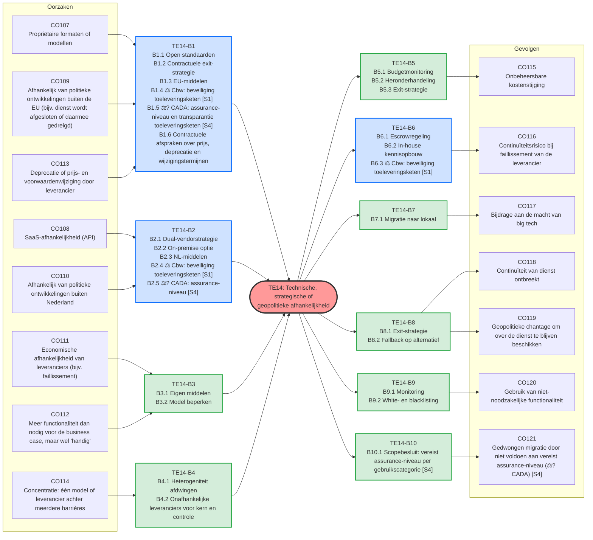
```mermaid
graph LR
    classDef legal fill:#cfe2ff,stroke:#0d6efd,stroke-width:2px
    classDef legalp fill:#e8f1ff,stroke:#0d6efd,stroke-width:2px,stroke-dasharray:5 3
    classDef bar fill:#d4edda,stroke:#28a745,stroke-width:2px
    classDef te fill:#ff9999,stroke:#333,stroke-width:3px
    classDef teref fill:#ffe0e0,stroke:#c00,stroke-width:2px,stroke-dasharray:4 3

    subgraph Oorzaken
        CO107["CO107<br/>Propriëtaire formaten of modellen"]
        CO108["CO108<br/>SaaS-afhankelijkheid (API)"]
        CO109["CO109<br/>Afhankelijk van politieke ontwikkelingen buiten de EU (bijv. dienst wordt afgesloten of daarmee gedreigd)"]
        CO110["CO110<br/>Afhankelijk van politieke ontwikkelingen buiten Nederland"]
        CO111["CO111<br/>Economische afhankelijkheid van leveranciers (bijv. faillissement)"]
        CO112["CO112<br/>Meer functionaliteit dan nodig voor de business case, maar wel 'handig'"]
        CO113["CO113<br/>Deprecatie of prijs- en voorwaardenwijziging door leverancier"]
        CO114["CO114<br/>Concentratie: één model of leverancier achter meerdere barrières"]
    end

    TE14(["TE14: Technische, strategische of<br/>geopolitieke afhankelijkheid"]):::te

    subgraph Gevolgen
        CO115["CO115<br/>Onbeheersbare kostenstijging"]
        CO116["CO116<br/>Continuïteitsrisico bij faillissement van de leverancier"]
        CO117["CO117<br/>Bijdrage aan de macht van big tech"]
        CO118["CO118<br/>Continuïteit van dienst ontbreekt"]
        CO119["CO119<br/>Geopolitieke chantage om over de dienst te blijven beschikken"]
        CO120["CO120<br/>Gebruik van niet-noodzakelijke functionaliteit"]
        CO121["CO121<br/>Gedwongen migratie door niet voldoen aan vereist assurance-niveau (⚖? CADA) [S4]"]
    end

    T14B1["TE14-B1<br/>B1.1 Open standaarden<br/>B1.2 Contractuele exit-strategie<br/>B1.3 EU-middelen<br/>B1.4 ⚖ Cbw: beveiliging toeleveringsketen [S1]<br/>B1.5 ⚖? CADA: assurance-niveau en transparantie toeleveringsketen [S4]<br/>B1.6 Contractuele afspraken over prijs, deprecatie en wijzigingstermijnen"]:::legal
    T14B2["TE14-B2<br/>B2.1 Dual-vendorstrategie<br/>B2.2 On-premise optie<br/>B2.3 NL-middelen<br/>B2.4 ⚖ Cbw: beveiliging toeleveringsketen [S1]<br/>B2.5 ⚖? CADA: assurance-niveau [S4]"]:::legal
    T14B3["TE14-B3<br/>B3.1 Eigen middelen<br/>B3.2 Model beperken"]:::bar
    T14B4["TE14-B4<br/>B4.1 Heterogeniteit afdwingen<br/>B4.2 Onafhankelijke leveranciers voor kern en controle"]:::bar
    T14B5["TE14-B5<br/>B5.1 Budgetmonitoring<br/>B5.2 Heronderhandeling<br/>B5.3 Exit-strategie"]:::bar
    T14B6["TE14-B6<br/>B6.1 Escrowregeling<br/>B6.2 In-house kennisopbouw<br/>B6.3 ⚖ Cbw: beveiliging toeleveringsketen [S1]"]:::legal
    T14B7["TE14-B7<br/>B7.1 Migratie naar lokaal"]:::bar
    T14B8["TE14-B8<br/>B8.1 Exit-strategie<br/>B8.2 Fallback op alternatief"]:::bar
    T14B9["TE14-B9<br/>B9.1 Monitoring<br/>B9.2 White- en blacklisting"]:::bar
    T14B10["TE14-B10<br/>B10.1 Scopebesluit: vereist assurance-niveau per gebruikscategorie [S4]"]:::bar

    CO107 --> T14B1
    T14B1 --> TE14
    CO108 --> T14B2
    T14B2 --> TE14
    CO109 --> T14B1
    CO110 --> T14B2
    CO111 --> T14B3
    T14B3 --> TE14
    CO112 --> T14B3
    CO113 --> T14B1
    CO114 --> T14B4
    T14B4 --> TE14
    TE14 --> T14B5
    T14B5 --> CO115
    TE14 --> T14B6
    T14B6 --> CO116
    TE14 --> T14B7
    T14B7 --> CO117
    TE14 --> T14B8
    T14B8 --> CO118
    T14B8 --> CO119
    TE14 --> T14B9
    T14B9 --> CO120
    TE14 --> T14B10
    T14B10 --> CO121
```

## TE15: Doelverschuiving (function creep)
*Het systeem wordt voor iets anders gebruikt dan ontworpen.*
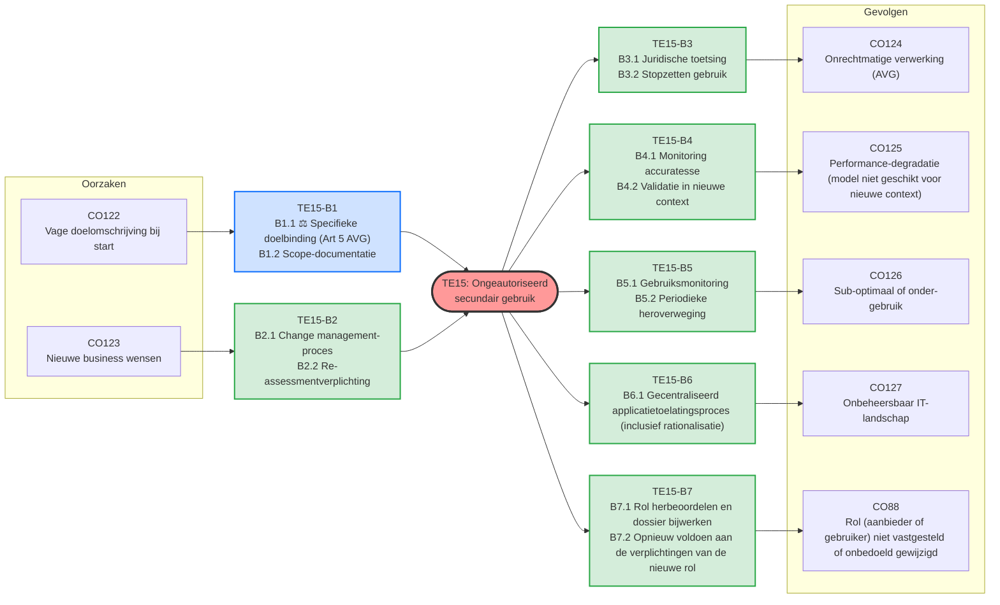
```mermaid
graph LR
    classDef legal fill:#cfe2ff,stroke:#0d6efd,stroke-width:2px
    classDef legalp fill:#e8f1ff,stroke:#0d6efd,stroke-width:2px,stroke-dasharray:5 3
    classDef bar fill:#d4edda,stroke:#28a745,stroke-width:2px
    classDef te fill:#ff9999,stroke:#333,stroke-width:3px
    classDef teref fill:#ffe0e0,stroke:#c00,stroke-width:2px,stroke-dasharray:4 3

    subgraph Oorzaken
        CO122["CO122<br/>Vage doelomschrijving bij start"]
        CO123["CO123<br/>Nieuwe business wensen"]
    end

    TE15(["TE15: Ongeautoriseerd<br/>secundair gebruik"]):::te

    subgraph Gevolgen
        CO124["CO124<br/>Onrechtmatige verwerking (AVG)"]
        CO125["CO125<br/>Performance-degradatie (model niet geschikt voor nieuwe context)"]
        CO126["CO126<br/>Sub-optimaal of onder-gebruik"]
        CO127["CO127<br/>Onbeheersbaar IT-landschap"]
        CO88["CO88<br/>Rol (aanbieder of gebruiker) niet vastgesteld of onbedoeld gewijzigd"]
    end

    T15B1["TE15-B1<br/>B1.1 ⚖ Specifieke doelbinding (Art 5 AVG)<br/>B1.2 Scope-documentatie"]:::legal
    T15B2["TE15-B2<br/>B2.1 Change management-proces<br/>B2.2 Re-assessmentverplichting"]:::bar
    T15B3["TE15-B3<br/>B3.1 Juridische toetsing<br/>B3.2 Stopzetten gebruik"]:::bar
    T15B4["TE15-B4<br/>B4.1 Monitoring accuratesse<br/>B4.2 Validatie in nieuwe context"]:::bar
    T15B5["TE15-B5<br/>B5.1 Gebruiksmonitoring<br/>B5.2 Periodieke heroverweging"]:::bar
    T15B6["TE15-B6<br/>B6.1 Gecentraliseerd applicatietoelatingsproces (inclusief rationalisatie)"]:::bar
    T15B7["TE15-B7<br/>B7.1 Rol herbeoordelen en dossier bijwerken<br/>B7.2 Opnieuw voldoen aan de verplichtingen van de nieuwe rol"]:::bar

    CO122 --> T15B1
    T15B1 --> TE15
    CO123 --> T15B2
    T15B2 --> TE15
    TE15 --> T15B3
    T15B3 --> CO124
    TE15 --> T15B4
    T15B4 --> CO125
    TE15 --> T15B5
    T15B5 --> CO126
    TE15 --> T15B6
    T15B6 --> CO127
    TE15 --> T15B7
    T15B7 --> CO88
```

## TE16: Ongeoorloofde monitoring en surveillance
*Werkvloer of publieke ruimte.*
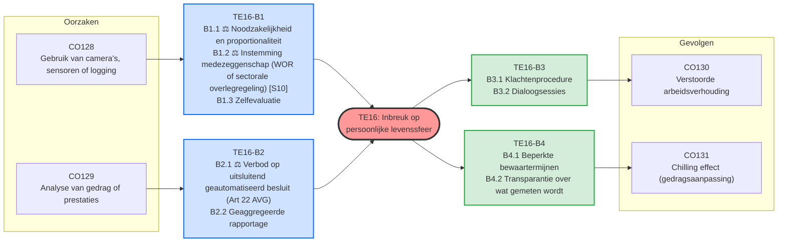
```mermaid
graph LR
    classDef legal fill:#cfe2ff,stroke:#0d6efd,stroke-width:2px
    classDef legalp fill:#e8f1ff,stroke:#0d6efd,stroke-width:2px,stroke-dasharray:5 3
    classDef bar fill:#d4edda,stroke:#28a745,stroke-width:2px
    classDef te fill:#ff9999,stroke:#333,stroke-width:3px
    classDef teref fill:#ffe0e0,stroke:#c00,stroke-width:2px,stroke-dasharray:4 3

    subgraph Oorzaken
        CO128["CO128<br/>Gebruik van camera's, sensoren of logging"]
        CO129["CO129<br/>Analyse van gedrag of prestaties"]
    end

    TE16(["TE16: Inbreuk op<br/>persoonlijke levenssfeer"]):::te

    subgraph Gevolgen
        CO130["CO130<br/>Verstoorde arbeidsverhouding"]
        CO131["CO131<br/>Chilling effect (gedragsaanpassing)"]
    end

    T16B1["TE16-B1<br/>B1.1 ⚖ Noodzakelijkheid en proportionaliteit<br/>B1.2 ⚖ Instemming medezeggenschap (WOR of sectorale overlegregeling) [S10]<br/>B1.3 Zelfevaluatie"]:::legal
    T16B2["TE16-B2<br/>B2.1 ⚖ Verbod op uitsluitend geautomatiseerd besluit (Art 22 AVG)<br/>B2.2 Geaggregeerde rapportage"]:::legal
    T16B3["TE16-B3<br/>B3.1 Klachtenprocedure<br/>B3.2 Dialoogsessies"]:::bar
    T16B4["TE16-B4<br/>B4.1 Beperkte bewaartermijnen<br/>B4.2 Transparantie over wat gemeten wordt"]:::bar

    CO128 --> T16B1
    T16B1 --> TE16
    CO129 --> T16B2
    T16B2 --> TE16
    TE16 --> T16B3
    T16B3 --> CO130
    TE16 --> T16B4
    T16B4 --> CO131
```

## TE17: Gebrek aan verantwoordelijkheid en regie
*Governance faalt.*
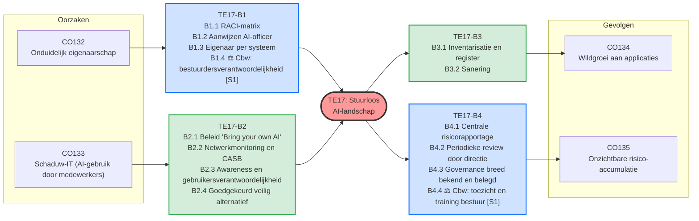
```mermaid
graph LR
    classDef legal fill:#cfe2ff,stroke:#0d6efd,stroke-width:2px
    classDef legalp fill:#e8f1ff,stroke:#0d6efd,stroke-width:2px,stroke-dasharray:5 3
    classDef bar fill:#d4edda,stroke:#28a745,stroke-width:2px
    classDef te fill:#ff9999,stroke:#333,stroke-width:3px
    classDef teref fill:#ffe0e0,stroke:#c00,stroke-width:2px,stroke-dasharray:4 3

    subgraph Oorzaken
        CO132["CO132<br/>Onduidelijk eigenaarschap"]
        CO133["CO133<br/>Schaduw-IT (AI-gebruik door medewerkers)"]
    end

    TE17(["TE17: Stuurloos<br/>AI-landschap"]):::te

    subgraph Gevolgen
        CO134["CO134<br/>Wildgroei aan applicaties"]
        CO135["CO135<br/>Onzichtbare risico-accumulatie"]
    end

    T17B1["TE17-B1<br/>B1.1 RACI-matrix<br/>B1.2 Aanwijzen AI-officer<br/>B1.3 Eigenaar per systeem<br/>B1.4 ⚖ Cbw: bestuurdersverantwoordelijkheid [S1]"]:::legal
    T17B2["TE17-B2<br/>B2.1 Beleid 'Bring your own AI'<br/>B2.2 Netwerkmonitoring en CASB<br/>B2.3 Awareness en gebruikersverantwoordelijkheid<br/>B2.4 Goedgekeurd veilig alternatief"]:::bar
    T17B3["TE17-B3<br/>B3.1 Inventarisatie en register<br/>B3.2 Sanering"]:::bar
    T17B4["TE17-B4<br/>B4.1 Centrale risicorapportage<br/>B4.2 Periodieke review door directie<br/>B4.3 Governance breed bekend en belegd<br/>B4.4 ⚖ Cbw: toezicht en training bestuur [S1]"]:::legal

    CO132 --> T17B1
    T17B1 --> TE17
    CO133 --> T17B2
    T17B2 --> TE17
    TE17 --> T17B3
    T17B3 --> CO134
    TE17 --> T17B4
    T17B4 --> CO135
```

## TE18: Verkeerd gebruik
*Onjuist of kwaadwillend gebruik van het systeem door gebruikers.*
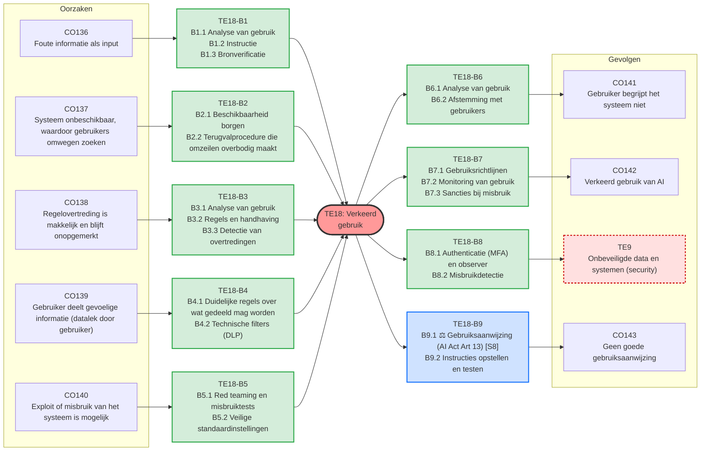
```mermaid
graph LR
    classDef legal fill:#cfe2ff,stroke:#0d6efd,stroke-width:2px
    classDef legalp fill:#e8f1ff,stroke:#0d6efd,stroke-width:2px,stroke-dasharray:5 3
    classDef bar fill:#d4edda,stroke:#28a745,stroke-width:2px
    classDef te fill:#ff9999,stroke:#333,stroke-width:3px
    classDef teref fill:#ffe0e0,stroke:#c00,stroke-width:2px,stroke-dasharray:4 3

    subgraph Oorzaken
        CO136["CO136<br/>Foute informatie als input"]
        CO137["CO137<br/>Systeem onbeschikbaar, waardoor gebruikers omwegen zoeken"]
        CO138["CO138<br/>Regelovertreding is makkelijk en blijft onopgemerkt"]
        CO139["CO139<br/>Gebruiker deelt gevoelige informatie (datalek door gebruiker)"]
        CO140["CO140<br/>Exploit of misbruik van het systeem is mogelijk"]
    end

    TE18(["TE18: Verkeerd<br/>gebruik"]):::te

    subgraph Gevolgen
        CO141["CO141<br/>Gebruiker begrijpt het systeem niet"]
        CO142["CO142<br/>Verkeerd gebruik van AI"]
        TE9ref["TE9<br/>Onbeveiligde data en systemen (security)"]:::teref
        CO143["CO143<br/>Geen goede gebruiksaanwijzing"]
    end

    T18B1["TE18-B1<br/>B1.1 Analyse van gebruik<br/>B1.2 Instructie<br/>B1.3 Bronverificatie"]:::bar
    T18B2["TE18-B2<br/>B2.1 Beschikbaarheid borgen<br/>B2.2 Terugvalprocedure die omzeilen overbodig maakt"]:::bar
    T18B3["TE18-B3<br/>B3.1 Analyse van gebruik<br/>B3.2 Regels en handhaving<br/>B3.3 Detectie van overtredingen"]:::bar
    T18B4["TE18-B4<br/>B4.1 Duidelijke regels over wat gedeeld mag worden<br/>B4.2 Technische filters (DLP)"]:::bar
    T18B5["TE18-B5<br/>B5.1 Red teaming en misbruiktests<br/>B5.2 Veilige standaardinstellingen"]:::bar
    T18B6["TE18-B6<br/>B6.1 Analyse van gebruik<br/>B6.2 Afstemming met gebruikers"]:::bar
    T18B7["TE18-B7<br/>B7.1 Gebruiksrichtlijnen<br/>B7.2 Monitoring van gebruik<br/>B7.3 Sancties bij misbruik"]:::bar
    T18B8["TE18-B8<br/>B8.1 Authenticatie (MFA) en observer<br/>B8.2 Misbruikdetectie"]:::bar
    T18B9["TE18-B9<br/>B9.1 ⚖ Gebruiksaanwijzing (AI Act Art 13) [S8]<br/>B9.2 Instructies opstellen en testen"]:::legal

    CO136 --> T18B1
    T18B1 --> TE18
    CO137 --> T18B2
    T18B2 --> TE18
    CO138 --> T18B3
    T18B3 --> TE18
    CO139 --> T18B4
    T18B4 --> TE18
    CO140 --> T18B5
    T18B5 --> TE18
    TE18 --> T18B6
    T18B6 --> CO141
    TE18 --> T18B7
    T18B7 --> CO142
    TE18 --> T18B8
    T18B8 --> TE9ref
    TE18 --> T18B9
    T18B9 --> CO143
```

## TE19: Systeem niet beschikbaar
*Beschikbaarheid van het AI-systeem en de werkprocessen die erop leunen.*
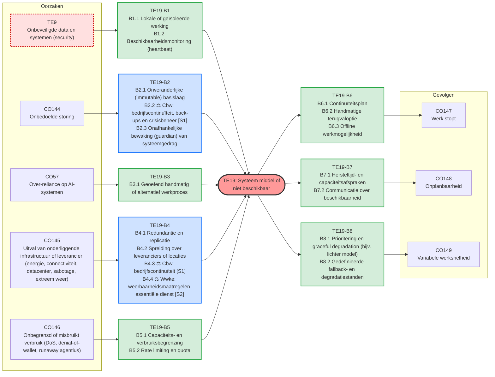
```mermaid
graph LR
    classDef legal fill:#cfe2ff,stroke:#0d6efd,stroke-width:2px
    classDef legalp fill:#e8f1ff,stroke:#0d6efd,stroke-width:2px,stroke-dasharray:5 3
    classDef bar fill:#d4edda,stroke:#28a745,stroke-width:2px
    classDef te fill:#ff9999,stroke:#333,stroke-width:3px
    classDef teref fill:#ffe0e0,stroke:#c00,stroke-width:2px,stroke-dasharray:4 3

    subgraph Oorzaken
        TE9ref["TE9<br/>Onbeveiligde data en systemen (security)"]:::teref
        CO144["CO144<br/>Onbedoelde storing"]
        CO57["CO57<br/>Over-reliance op AI-systemen"]
        CO145["CO145<br/>Uitval van onderliggende infrastructuur of leverancier (energie, connectiviteit, datacenter, sabotage, extreem weer)"]
        CO146["CO146<br/>Onbegrensd of misbruikt verbruik (DoS, denial-of-wallet, runaway agentlus)"]
    end

    TE19(["TE19: Systeem middel of<br/>niet beschikbaar"]):::te

    subgraph Gevolgen
        CO147["CO147<br/>Werk stopt"]
        CO148["CO148<br/>Onplanbaarheid"]
        CO149["CO149<br/>Variabele werksnelheid"]
    end

    T19B1["TE19-B1<br/>B1.1 Lokale of geïsoleerde werking<br/>B1.2 Beschikbaarheidsmonitoring (heartbeat)"]:::bar
    T19B2["TE19-B2<br/>B2.1 Onveranderlijke (immutable) basislaag<br/>B2.2 ⚖ Cbw: bedrijfscontinuïteit, back-ups en crisisbeheer [S1]<br/>B2.3 Onafhankelijke bewaking (guardian) van systeemgedrag"]:::legal
    T19B3["TE19-B3<br/>B3.1 Geoefend handmatig of alternatief werkproces"]:::bar
    T19B4["TE19-B4<br/>B4.1 Redundantie en replicatie<br/>B4.2 Spreiding over leveranciers of locaties<br/>B4.3 ⚖ Cbw: bedrijfscontinuïteit [S1]<br/>B4.4 ⚖ Wwke: weerbaarheidsmaatregelen essentiële dienst [S2]"]:::legal
    T19B5["TE19-B5<br/>B5.1 Capaciteits- en verbruiksbegrenzing<br/>B5.2 Rate limiting en quota"]:::bar
    T19B6["TE19-B6<br/>B6.1 Continuïteitsplan<br/>B6.2 Handmatige terugvaloptie<br/>B6.3 Offline werkmogelijkheid"]:::bar
    T19B7["TE19-B7<br/>B7.1 Hersteltijd- en capaciteitsafspraken<br/>B7.2 Communicatie over beschikbaarheid"]:::bar
    T19B8["TE19-B8<br/>B8.1 Prioritering en graceful degradation (bijv. lichter model)<br/>B8.2 Gedefinieerde fallback- en degradatiestanden"]:::bar

    TE9ref --> T19B1
    T19B1 --> TE19
    CO144 --> T19B2
    T19B2 --> TE19
    CO57 --> T19B3
    T19B3 --> TE19
    CO145 --> T19B4
    T19B4 --> TE19
    CO146 --> T19B5
    T19B5 --> TE19
    TE19 --> T19B6
    T19B6 --> CO147
    TE19 --> T19B7
    T19B7 --> CO148
    TE19 --> T19B8
    T19B8 --> CO149
```

## TE20: Onbeheersbare generatieve output (GenAI/LLM)
*Large language models en generatieve AI. Voorwaardelijk (S9).*
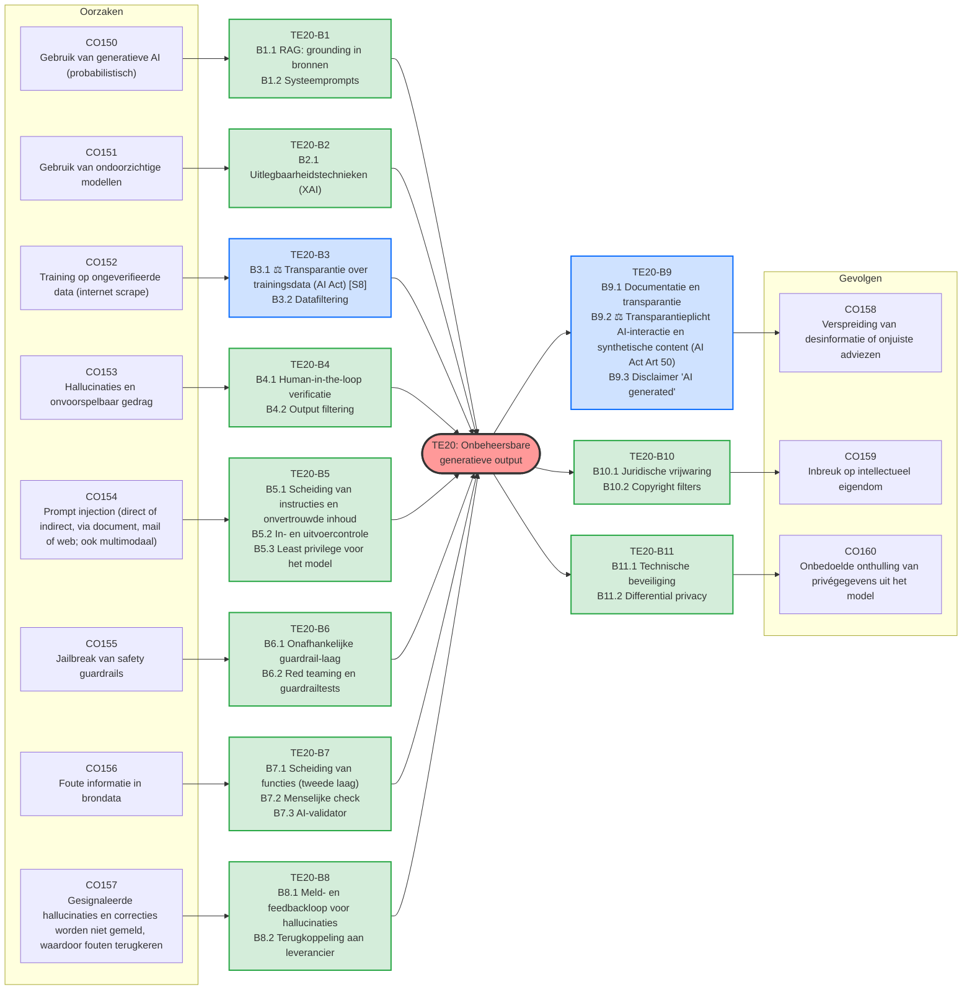
```mermaid
graph LR
    classDef legal fill:#cfe2ff,stroke:#0d6efd,stroke-width:2px
    classDef legalp fill:#e8f1ff,stroke:#0d6efd,stroke-width:2px,stroke-dasharray:5 3
    classDef bar fill:#d4edda,stroke:#28a745,stroke-width:2px
    classDef te fill:#ff9999,stroke:#333,stroke-width:3px
    classDef teref fill:#ffe0e0,stroke:#c00,stroke-width:2px,stroke-dasharray:4 3

    subgraph Oorzaken
        CO150["CO150<br/>Gebruik van generatieve AI (probabilistisch)"]
        CO151["CO151<br/>Gebruik van ondoorzichtige modellen"]
        CO152["CO152<br/>Training op ongeverifieerde data (internet scrape)"]
        CO153["CO153<br/>Hallucinaties en onvoorspelbaar gedrag"]
        CO154["CO154<br/>Prompt injection (direct of indirect, via document, mail of web; ook multimodaal)"]
        CO155["CO155<br/>Jailbreak van safety guardrails"]
        CO156["CO156<br/>Foute informatie in brondata"]
        CO157["CO157<br/>Gesignaleerde hallucinaties en correcties worden niet gemeld, waardoor fouten terugkeren"]
    end

    TE20(["TE20: Onbeheersbare<br/>generatieve output"]):::te

    subgraph Gevolgen
        CO158["CO158<br/>Verspreiding van desinformatie of onjuiste adviezen"]
        CO159["CO159<br/>Inbreuk op intellectueel eigendom"]
        CO160["CO160<br/>Onbedoelde onthulling van privégegevens uit het model"]
    end

    T20B1["TE20-B1<br/>B1.1 RAG: grounding in bronnen<br/>B1.2 Systeemprompts"]:::bar
    T20B2["TE20-B2<br/>B2.1 Uitlegbaarheidstechnieken (XAI)"]:::bar
    T20B3["TE20-B3<br/>B3.1 ⚖ Transparantie over trainingsdata (AI Act) [S8]<br/>B3.2 Datafiltering"]:::legal
    T20B4["TE20-B4<br/>B4.1 Human-in-the-loop verificatie<br/>B4.2 Output filtering"]:::bar
    T20B5["TE20-B5<br/>B5.1 Scheiding van instructies en onvertrouwde inhoud<br/>B5.2 In- en uitvoercontrole<br/>B5.3 Least privilege voor het model"]:::bar
    T20B6["TE20-B6<br/>B6.1 Onafhankelijke guardrail-laag<br/>B6.2 Red teaming en guardrailtests"]:::bar
    T20B7["TE20-B7<br/>B7.1 Scheiding van functies (tweede laag)<br/>B7.2 Menselijke check<br/>B7.3 AI-validator"]:::bar
    T20B8["TE20-B8<br/>B8.1 Meld- en feedbackloop voor hallucinaties<br/>B8.2 Terugkoppeling aan leverancier"]:::bar
    T20B9["TE20-B9<br/>B9.1 Documentatie en transparantie<br/>B9.2 ⚖ Transparantieplicht AI-interactie en synthetische content (AI Act Art 50)<br/>B9.3 Disclaimer 'AI generated'"]:::legal
    T20B10["TE20-B10<br/>B10.1 Juridische vrijwaring<br/>B10.2 Copyright filters"]:::bar
    T20B11["TE20-B11<br/>B11.1 Technische beveiliging<br/>B11.2 Differential privacy"]:::bar

    CO150 --> T20B1
    T20B1 --> TE20
    CO151 --> T20B2
    T20B2 --> TE20
    CO152 --> T20B3
    T20B3 --> TE20
    CO153 --> T20B4
    T20B4 --> TE20
    CO154 --> T20B5
    T20B5 --> TE20
    CO155 --> T20B6
    T20B6 --> TE20
    CO156 --> T20B7
    T20B7 --> TE20
    CO157 --> T20B8
    T20B8 --> TE20
    TE20 --> T20B9
    T20B9 --> CO158
    TE20 --> T20B10
    T20B10 --> CO159
    TE20 --> T20B11
    T20B11 --> CO160
```

## TE21: Overregulatie
*Compliance-last die zelf een risico vormt.*
```mermaid
graph LR
    classDef legal fill:#cfe2ff,stroke:#0d6efd,stroke-width:2px
    classDef legalp fill:#e8f1ff,stroke:#0d6efd,stroke-width:2px,stroke-dasharray:5 3
    classDef bar fill:#d4edda,stroke:#28a745,stroke-width:2px
    classDef te fill:#ff9999,stroke:#333,stroke-width:3px
    classDef teref fill:#ffe0e0,stroke:#c00,stroke-width:2px,stroke-dasharray:4 3

    subgraph Oorzaken
        CO161["CO161<br/>Overmatige of ondoordachte wetgeving rond AI"]
        CO162["CO162<br/>Overlappende of tegenstrijdige regels (AI Act, AVG, Cbw, CRA, CADA)"]
        CO163["CO163<br/>Veelvuldig toezicht en verantwoordingsverplichtingen"]
        CO164["CO164<br/>Gebruiker of opdrachtgever stelt (te) hoge eisen"]
        CO165["CO165<br/>Interne regels zwaarder dan de wet"]
        CO166["CO166<br/>Compliance-latentie (DPIA, inkoop, goedkeuring duurt maanden)"]
    end

    TE21(["TE21: Belemmerende<br/>compliance"]):::te

    subgraph Gevolgen
        CO167["CO167<br/>Beperkte innovatie, concurrentiepositie verloren"]
        CO168["CO168<br/>Druk om non-compliant te implementeren"]
        CO169["CO169<br/>Hoge drempel voor een positieve business case"]
        CO170["CO170<br/>(Te) hoge kosten"]
        CO171["CO171<br/>Kan niet tijdig aan behoeften voldoen"]
    end

    T21B1["TE21-B1<br/>B1.1 Proportionele toepassing via scopebesluiten<br/>B1.2 Gedeelde interpretatie met toezichthouder"]:::bar
    T21B2["TE21-B2<br/>B2.1 Geïntegreerd meld- en toezichtproces<br/>B2.2 Regimes naast elkaar gemapt"]:::bar
    T21B3["TE21-B3<br/>B3.1 Eén dossier voor meerdere toezichthouders<br/>B3.2 Hergebruik van bewijsstukken"]:::bar
    T21B4["TE21-B4<br/>B4.1 Eisen onderbouwen met risicoanalyse<br/>B4.2 Verwachtingsmanagement"]:::bar
    T21B5["TE21-B5<br/>B5.1 Regeldruktoets op interne regels"]:::bar
    T21B6["TE21-B6<br/>B6.1 Compliance as code<br/>B6.2 Vroegtijdige afstemming met privacy, beveiliging en juridisch"]:::bar
    T21B7["TE21-B7<br/>B7.1 Compliance by design<br/>B7.2 Veilige proefruimte (sandbox)"]:::bar
    T21B8["TE21-B8<br/>B8.1 Geïntegreerde risicoworkshop (GWR-methode)<br/>B8.2 Escalatieroute bij rood risico-oordeel"]:::bar
    T21B9["TE21-B9<br/>B9.1 Hergebruik van publieke risicoanalyses<br/>B9.2 Gedeelde sjablonen"]:::bar
    T21B10["TE21-B10<br/>B10.1 Doorlooptijddoelen<br/>B10.2 Versnelde route voor laag risico"]:::bar

    CO161 --> T21B1
    T21B1 --> TE21
    CO162 --> T21B2
    T21B2 --> TE21
    CO163 --> T21B3
    T21B3 --> TE21
    CO164 --> T21B4
    T21B4 --> TE21
    CO165 --> T21B5
    T21B5 --> TE21
    CO166 --> T21B6
    T21B6 --> TE21
    TE21 --> T21B7
    T21B7 --> CO167
    TE21 --> T21B8
    T21B8 --> CO168
    TE21 --> T21B9
    T21B9 --> CO169
    T21B9 --> CO170
    TE21 --> T21B10
    T21B10 --> CO171
```

## TE22: Ongeautoriseerde of onbedoelde acties door AI-agent
*Een AI-agent voert met tools, API's of schrijfrechten acties uit buiten het bedoelde mandaat. Voorwaardelijk (S5).*
```mermaid
graph LR
    classDef legal fill:#cfe2ff,stroke:#0d6efd,stroke-width:2px
    classDef legalp fill:#e8f1ff,stroke:#0d6efd,stroke-width:2px,stroke-dasharray:5 3
    classDef bar fill:#d4edda,stroke:#28a745,stroke-width:2px
    classDef te fill:#ff9999,stroke:#333,stroke-width:3px
    classDef teref fill:#ffe0e0,stroke:#c00,stroke-width:2px,stroke-dasharray:4 3

    subgraph Oorzaken
        CO154["CO154<br/>Prompt injection (direct of indirect, via document, mail of web; ook multimodaal)"]
        CO172["CO172<br/>Vergiftigde tool-beschrijving of niet-vertrouwde tool-server (MCP)"]
        CO173["CO173<br/>Te ruime tool- en toegangsrechten (excessive agency)"]
        CO174["CO174<br/>Misbruik of overerving van identiteit of credentials (gedeelde service-accounts, te ruime OAuth-scopes)"]
        CO175["CO175<br/>Onvalideerde output wordt uitgevoerd of doorgegeven aan downstream-systemen of code, ook automatisch"]
        CO176["CO176<br/>Vergiftigd of persistent geheugen of context"]
        CO177["CO177<br/>Onveilige agent-tot-agentcommunicatie (agents lezen elkaars output ongecontroleerd)"]
        CO178["CO178<br/>Kwetsbaarheid in orchestrator of agentframework"]
        CO179["CO179<br/>Onderspecificeerd doel of reward hacking; onhaalbare taak zonder stop-en-vraag-route"]
    end

    TE22(["TE22: Ongeautoriseerde of<br/>onbedoelde agent-acties"]):::te

    subgraph Gevolgen
        CO180["CO180<br/>Onomkeerbare handeling met externe effecten (ook onbedoelde datamanipulatie)"]
        CO181["CO181<br/>Datalekkage via toolgebruik en misbruik van gelekte credentials"]
        CO182["CO182<br/>Uitvoering van schadelijke code"]
        CO183["CO183<br/>Verspreiding over gekoppelde agents en systemen (persistente toegang of infectie)"]
        CO184["CO184<br/>Schade of inbreuk bij derden en ketenpartners"]
        CO185["CO185<br/>Onbeheerste kosten of resourceverbruik"]
        CO186["CO186<br/>Onduidelijke verantwoordelijkheid voor het handelen van de agent"]
    end

    T22B1["TE22-B1<br/>B1.1 Scheiding van instructies en onvertrouwde inhoud<br/>B1.2 Deterministisch beleid boven model of mensklik<br/>B1.3 Goal- en prompt-governance"]:::bar
    T22B2["TE22-B2<br/>B2.1 Integriteit van geheugen en tool- of agentdescriptoren (gepind, ondertekend)<br/>B2.2 Gemedieerd kanaal tussen agents"]:::bar
    T22B3["TE22-B3<br/>B3.1 Least privilege en scoping van tools en identiteiten<br/>B3.2 Eigen identiteit per agent"]:::bar
    T22B4["TE22-B4<br/>B4.1 Validatie van toolargumenten en gegenereerde output vóór uitvoering<br/>B4.2 Geen automatische uitvoering"]:::bar
    T22B5["TE22-B5<br/>B5.1 Kwetsbaarhedenbeheer en hardening van orchestrator of agentframework (zie TE-09)"]:::bar
    T22B6["TE22-B6<br/>B6.1 Mandaatbegrenzing per agent (doel, stopvoorwaarden)"]:::bar
    T22B7["TE22-B7<br/>B7.1 Menselijke autorisatie bij onomkeerbare acties"]:::bar
    T22B8["TE22-B8<br/>B8.1 Monitoring en limieten op toolgebruik<br/>B8.2 Egress begrenzen<br/>B8.3 Noodstop en containment"]:::bar
    T22B9["TE22-B9<br/>B9.1 Sandboxing en containment van uitvoering met beperkte rechten<br/>B9.2 Herstel via snapshots of rollback"]:::bar
    T22B10["TE22-B10<br/>B10.1 Meldprotocol voor schade bij derden"]:::bar
    T22B11["TE22-B11<br/>B11.1 Audittrail van acties<br/>B11.2 Eigenaar per agent"]:::bar

    CO154 --> T22B1
    T22B1 --> TE22
    CO172 --> T22B2
    T22B2 --> TE22
    CO173 --> T22B3
    T22B3 --> TE22
    CO174 --> T22B3
    CO175 --> T22B4
    T22B4 --> TE22
    CO176 --> T22B2
    CO177 --> T22B2
    CO178 --> T22B5
    T22B5 --> TE22
    CO179 --> T22B6
    T22B6 --> TE22
    TE22 --> T22B7
    T22B7 --> CO180
    TE22 --> T22B8
    T22B8 --> CO181
    TE22 --> T22B9
    T22B9 --> CO182
    T22B8 --> CO183
    TE22 --> T22B10
    T22B10 --> CO184
    T22B8 --> CO185
    TE22 --> T22B11
    T22B11 --> CO186
```

## TE23: Onjuist beheer van AI-informatie (bewaren, openbaar maken, vernietigen)
*Spanning tussen archivering en openbaarheid enerzijds en privacy, beveiliging en dataminimalisatie anderzijds.*
```mermaid
graph LR
    classDef legal fill:#cfe2ff,stroke:#0d6efd,stroke-width:2px
    classDef legalp fill:#e8f1ff,stroke:#0d6efd,stroke-width:2px,stroke-dasharray:5 3
    classDef bar fill:#d4edda,stroke:#28a745,stroke-width:2px
    classDef te fill:#ff9999,stroke:#333,stroke-width:3px
    classDef teref fill:#ffe0e0,stroke:#c00,stroke-width:2px,stroke-dasharray:4 3

    subgraph Oorzaken
        CO187["CO187<br/>Prompts, outputs en logs niet geclassificeerd als overheidsinformatie"]
        CO188["CO188<br/>Botsende bewaartermijnen (opslagbeperking tegenover archiefplicht en logging-eisen)"]
        CO189["CO189<br/>Woo-verzoek zonder werkende procedure"]
        CO190["CO190<br/>Logging bevat meer persoonsgegevens of gevoelige inhoud dan nodig"]
        CO191["CO191<br/>AI-gegenereerde content zonder herleidbare herkomst (model, versie, prompt, bron)"]
        CO192["CO192<br/>Verantwoordelijkheid voor informatiebeheer van AI-systemen onbelegd"]
    end

    TE23(["TE23: Informatie uit AI-gebruik ten<br/>onrechte bewaard, vernietigd<br/>of openbaar"]):::te

    subgraph Gevolgen
        CO193["CO193<br/>Schending van de Archiefwet (te vroeg vernietigd of niet bewaard)"]
        CO194["CO194<br/>Schending van Woo-verplichtingen (te laat of onterecht geweigerd)"]
        CO195["CO195<br/>Onrechtmatige openbaarmaking van persoonsgegevens of bedrijfsgeheimen"]
        CO196["CO196<br/>Geen bewijs voor verantwoording of herleiding van een besluit"]
    end

    T23B1["TE23-B1<br/>B1.1 Classificatie van AI-in- en uitvoer als overheidsinformatie<br/>B1.2 Opname in het informatiebeheersysteem"]:::bar
    T23B2["TE23-B2<br/>B2.1 ⚖ Bewaren en selecteren volgens selectielijst (Archiefwet)<br/>B2.2 ⚖ Opslagbeperking (Art 5 AVG)<br/>B2.3 ⚖ Bewaring van logs minstens 6 maanden (AI Act Art 19 en 26) [S8]<br/>B2.4 Bewaartermijn vastleggen per informatiecategorie"]:::legal
    T23B3["TE23-B3<br/>B3.1 ⚖ Woo-toets en lakprocedure voor AI-informatie (Woo)<br/>B3.2 Aanspreekpunt en doorlooptijdbewaking"]:::legal
    T23B4["TE23-B4<br/>B4.1 Metadata-only logging<br/>B4.2 Pseudonimiseren of minimaliseren van prompt- en outputlogs"]:::bar
    T23B5["TE23-B5<br/>B5.1 Herkomstmetadata vastleggen (model, versie, prompt, bron)<br/>B5.2 Gebruikte brondata vastleggen"]:::bar
    T23B6["TE23-B6<br/>B6.1 Informatiebeheerder en eigenaar per systeem aanwijzen<br/>B6.2 Informatiebeheer betrekken bij het ontwerp"]:::bar
    T23B7["TE23-B7<br/>B7.1 Controle op naleving van de selectielijst<br/>B7.2 Herstel of reconstructie waar mogelijk"]:::bar
    T23B8["TE23-B8<br/>B8.1 Doorlooptijdbewaking<br/>B8.2 Juridische toets van weigeringsgronden<br/>B8.3 Bezwaarprocedure"]:::bar
    T23B9["TE23-B9<br/>B9.1 Lakken of anonimiseren vóór openbaarmaking<br/>B9.2 Vierogenprincipe<br/>B9.3 Meldprocedure datalek (zie TE3)"]:::bar
    T23B10["TE23-B10<br/>B10.1 Bijdrage van AI aan het besluit vastleggen in het dossier<br/>B10.2 Audit trail"]:::bar

    CO187 --> T23B1
    T23B1 --> TE23
    CO188 --> T23B2
    T23B2 --> TE23
    CO189 --> T23B3
    T23B3 --> TE23
    CO190 --> T23B4
    T23B4 --> TE23
    CO191 --> T23B5
    T23B5 --> TE23
    CO192 --> T23B6
    T23B6 --> TE23
    TE23 --> T23B7
    T23B7 --> CO193
    TE23 --> T23B8
    T23B8 --> CO194
    TE23 --> T23B9
    T23B9 --> CO195
    TE23 --> T23B10
    T23B10 --> CO196
```

---

## CO-register

| CO | Omschrijving | Oorzaak in | Gevolg in |
|---|---|---|---|
| CO1 | Gebiaseerde trainingsdata (historische vooroordelen) | TE1 | — |
| CO2 | Gebrek aan diverse teams (ontwerp-bias) | TE1 | — |
| CO3 | Gebruik van proxy-variabelen | TE1 | — |
| CO4 | Demografische verschillen niet expliciet afgewogen (fairness) | TE1 | — |
| CO5 | Testdata niet representatief | TE1 | — |
| CO6 | Discriminatoire uitkomsten | — | TE1 |
| CO7 | Verlies van publiek vertrouwen | — | TE1 |
| CO8 | Verzwakking van democratische waarden | — | TE1 |
| CO9 | Tekortkomingen in datakwaliteit of -volume | TE2 | — |
| CO10 | Afname nauwkeurigheid (model drift) | TE2 | — |
| CO11 | Ontoereikende kwaliteitscontrole | TE2 | — |
| CO12 | Gebrek aan technologische gereedheid | TE2 | — |
| CO13 | Ontbrekend of gebrekkig back-upplan | TE2 | — |
| CO14 | Stille modelwijziging door leverancier | TE2 | — |
| CO15 | Model gedraagt zich in productie anders dan in test | TE2 | — |
| CO16 | Testset niet representatief voor productie | TE2 | — |
| CO17 | Operationele inefficiëntie | — | TE2 |
| CO18 | Foutieve besluitvorming | — | TE2 |
| CO19 | Materiële of fysieke schade | — | TE2 |
| CO20 | Verwerking van bijzondere persoonsgegevens | TE3 | — |
| CO21 | Algemene niet-naleving van AVG-vereisten | TE3 | — |
| CO22 | Schending van doelbinding (function creep) | TE3 | — |
| CO23 | Stelselmatige monitoring of surveillance | TE3 | — |
| CO24 | Verlies of diefstal van apparaten of media | TE3, TE9 | — |
| CO25 | Niet-naleving van aanvullende sector- en domeinregels (bijv. Arbowet, beveiligingsnormen) | TE3 | — |
| CO26 | Gevoelige data in trainingsset zonder minimalisatie | TE3 | — |
| CO27 | Verwerking via leverancier of sub-verwerkers zonder verwerkersovereenkomst of melding | TE3 | — |
| CO28 | Doorgifte van persoonsgegevens buiten de EER zonder passende waarborgen | TE3 | — |
| CO29 | Bestuurlijke boetes | — | TE3 |
| CO30 | Impact op fundamentele rechten | — | TE3 |
| CO31 | Datalek of beveiligingsincident | — | TE3 |
| CO32 | Aantasting van rechtsstatelijke waarborgen | — | TE3 |
| CO33 | Gebruik in nieuw maatschappelijk domein | TE4 | — |
| CO34 | Hoog niveau van autonomie | TE4 | — |
| CO35 | Juridisch belangrijke beslissingen | TE4 | — |
| CO36 | Complexe of dynamische implementatieomgeving | TE4 | — |
| CO37 | Hoge taakcomplexiteit (ambigue doelen) | TE4 | — |
| CO38 | Hoogrisicoclassificatie onduidelijk of onjuist vastgesteld | TE4 | — |
| CO39 | Gevoelige gebruikstriggers | — | TE4 |
| CO40 | Ernstige impact bij falen | — | TE4 |
| CO41 | Maatschappelijke onrust | — | TE4 |
| CO42 | Imago- en politieke schade door schending van publieke waarden | — | TE4 |
| CO43 | Letsel of overlijden | — | TE4 |
| CO44 | Gebruik van complexe modellen (deep learning) | TE5 | — |
| CO45 | Propriëtaire algoritmes: leverancier geeft geen inzicht | TE5 | — |
| CO46 | Onduidelijke UI/UX voor eindgebruiker | TE5 | — |
| CO47 | Inconsistente definities of 'waarheden' binnen de organisatie | TE5 | — |
| CO48 | Onmogelijkheid tot verantwoording | — | TE5 |
| CO49 | Gebruikers wantrouwen of negeren de output | — | TE5 |
| CO50 | Automation bias: mens vertrouwt blind op de computer | TE6 | — |
| CO51 | Te hoge snelheid van beslissingen | TE6 | — |
| CO52 | Interface nodigt niet uit tot ingrijpen | TE6 | — |
| CO53 | De-skilling door uitbesteden van denkwerk | TE6 | — |
| CO54 | Verlies van waardevolle kennis | TE6 | — |
| CO55 | Onopgemerkte systeemfouten | — | TE6 |
| CO56 | Geen geldig besluit (bestuursrecht) | — | TE6 |
| CO57 | Over-reliance op AI-systemen | TE19 | TE6 |
| CO58 | Optimalisatie voor één metriek (bijv. winst versus welzijn) | TE7 | — |
| CO59 | Negeren van externe effecten | TE7 | — |
| CO60 | Verlies van werkgelegenheid of werkkwaliteit | — | TE7 |
| CO61 | Sociale onrust of publieke ophef | — | TE7 |
| CO62 | Reward hacking: AI vindt een sluiproute naar het doel | TE8 | — |
| CO63 | Interactie met andere systemen (cascading effects) | TE8 | — |
| CO64 | Foute of onbetrouwbare inputinformatie | TE8 | — |
| CO65 | Geen onafhankelijke controlelaag op afwijkend gedrag | TE8 | — |
| CO66 | Schade aan omgeving of infrastructuur | — | TE8 |
| CO67 | Financiële verliezen | — | TE8 |
| CO68 | Model inversion attacks (trainingsdata uit het model halen) | TE9 | — |
| CO69 | Adversarial examples (inputmanipulatie) | TE9 | — |
| CO70 | Onveilige API's of interfaces | TE9 | — |
| CO71 | Social engineering | TE9 | — |
| CO72 | Compromittering van de toeleveringsketen (repo, model, dataset, dependency, tool-server) | TE9 | — |
| CO73 | Kwaadwillige exploits | TE9 | — |
| CO74 | Opzettelijke vergiftiging (poisoning) van trainings-, fine-tuning- of retrievaldata | TE9 | — |
| CO75 | Gevoelige informatie of credentials in systeemprompt of context | TE9 | — |
| CO76 | Onvoldoende scheiding of toegangscontrole in vector- en retrievalopslag [S6] | TE9 | — |
| CO77 | Onveilige of ongereviewde AI-gegenereerde code [S7] | TE9 | — |
| CO78 | Gehallucineerde of kwetsbare dependencies | TE9 | — |
| CO79 | Gemanipuleerde modelartefacten (backdoor, onveilig serialisatieformaat) | TE9 | — |
| CO80 | Niet-geautoriseerde applicatie of client krijgt toegang tot het model of de inference-engine | TE9 | — |
| CO81 | Publicatie van code, prompts of configuratie maakt kwetsbaarheden of gevoelige informatie openbaar [S11] | TE9 | — |
| CO82 | Diefstal van intellectueel eigendom | — | TE9 |
| CO83 | Manipulatie van output | — | TE9 |
| CO84 | Onherstelbare blootstelling door toekomstige cryptanalyse (bijv. quantum) | — | TE9 |
| CO85 | Onjuiste of onrechtmatige besluiten over burgers door gemanipuleerd model of data | — | TE9 |
| CO86 | Onduidelijk juridisch kader | TE10 | — |
| CO87 | Gebrek aan interne governance | TE10 | — |
| CO88 | Rol (aanbieder of gebruiker) niet vastgesteld of onbedoeld gewijzigd | TE10 | TE15 |
| CO89 | Open-sourcepublicatie wordt onbedoeld commerciële activiteit of valt buiten de vrijstelling [S11] | TE10 | — |
| CO90 | Sancties van toezichthouders | — | TE10 |
| CO91 | Ethische blindheid in de organisatie | — | TE10 |
| CO92 | Schending van arbeidsrecht of auteursrecht (plagiaat) | — | TE10 |
| CO93 | Ongelijke performance over groepen (werkt goed voor A, slecht voor B) | TE11 | — |
| CO94 | Toewijzingsbias | TE11 | — |
| CO95 | Vergroting van de digitale kloof | — | TE11 |
| CO96 | Uitsluiting van diensten | — | TE11 |
| CO97 | Ongelijkheid blijft onopgemerkt (geen feedbackloop) | — | TE11 |
| CO98 | Waardenconflict (efficiëntie versus solidariteit) | TE12 | — |
| CO99 | Culturele bias in trainingsdata | TE12 | — |
| CO100 | Maatschappelijke verontwaardiging | — | TE12 |
| CO101 | Politieke interventie | — | TE12 |
| CO102 | Inefficiënte modelarchitectuur | TE13 | — |
| CO103 | Onnodig hertrainen | TE13 | — |
| CO104 | Wildgroei van data-opslag | TE13 | — |
| CO105 | Disproportionele CO2-footprint | — | TE13 |
| CO106 | Duurzaamheidsdoelen niet gehaald | — | TE13 |
| CO107 | Propriëtaire formaten of modellen | TE14 | — |
| CO108 | SaaS-afhankelijkheid (API) | TE14 | — |
| CO109 | Afhankelijk van politieke ontwikkelingen buiten de EU (bijv. dienst wordt afgesloten of daarmee gedreigd) | TE14 | — |
| CO110 | Afhankelijk van politieke ontwikkelingen buiten Nederland | TE14 | — |
| CO111 | Economische afhankelijkheid van leveranciers (bijv. faillissement) | TE14 | — |
| CO112 | Meer functionaliteit dan nodig voor de business case, maar wel 'handig' | TE14 | — |
| CO113 | Deprecatie of prijs- en voorwaardenwijziging door leverancier | TE14 | — |
| CO114 | Concentratie: één model of leverancier achter meerdere barrières | TE14 | — |
| CO115 | Onbeheersbare kostenstijging | — | TE14 |
| CO116 | Continuïteitsrisico bij faillissement van de leverancier | — | TE14 |
| CO117 | Bijdrage aan de macht van big tech | — | TE14 |
| CO118 | Continuïteit van dienst ontbreekt | — | TE14 |
| CO119 | Geopolitieke chantage om over de dienst te blijven beschikken | — | TE14 |
| CO120 | Gebruik van niet-noodzakelijke functionaliteit | — | TE14 |
| CO121 | Gedwongen migratie door niet voldoen aan vereist assurance-niveau (⚖? CADA) [S4] | — | TE14 |
| CO122 | Vage doelomschrijving bij start | TE15 | — |
| CO123 | Nieuwe business wensen | TE15 | — |
| CO124 | Onrechtmatige verwerking (AVG) | — | TE15 |
| CO125 | Performance-degradatie (model niet geschikt voor nieuwe context) | — | TE15 |
| CO126 | Sub-optimaal of onder-gebruik | — | TE15 |
| CO127 | Onbeheersbaar IT-landschap | — | TE15 |
| CO128 | Gebruik van camera's, sensoren of logging | TE16 | — |
| CO129 | Analyse van gedrag of prestaties | TE16 | — |
| CO130 | Verstoorde arbeidsverhouding | — | TE16 |
| CO131 | Chilling effect (gedragsaanpassing) | — | TE16 |
| CO132 | Onduidelijk eigenaarschap | TE17 | — |
| CO133 | Schaduw-IT (AI-gebruik door medewerkers) | TE17 | — |
| CO134 | Wildgroei aan applicaties | — | TE17 |
| CO135 | Onzichtbare risico-accumulatie | — | TE17 |
| CO136 | Foute informatie als input | TE18 | — |
| CO137 | Systeem onbeschikbaar, waardoor gebruikers omwegen zoeken | TE18 | — |
| CO138 | Regelovertreding is makkelijk en blijft onopgemerkt | TE18 | — |
| CO139 | Gebruiker deelt gevoelige informatie (datalek door gebruiker) | TE18 | — |
| CO140 | Exploit of misbruik van het systeem is mogelijk | TE18 | — |
| CO141 | Gebruiker begrijpt het systeem niet | — | TE18 |
| CO142 | Verkeerd gebruik van AI | — | TE18 |
| CO143 | Geen goede gebruiksaanwijzing | — | TE18 |
| CO144 | Onbedoelde storing | TE19 | — |
| CO145 | Uitval van onderliggende infrastructuur of leverancier (energie, connectiviteit, datacenter, sabotage, extreem weer) | TE19 | — |
| CO146 | Onbegrensd of misbruikt verbruik (DoS, denial-of-wallet, runaway agentlus) | TE19 | — |
| CO147 | Werk stopt | — | TE19 |
| CO148 | Onplanbaarheid | — | TE19 |
| CO149 | Variabele werksnelheid | — | TE19 |
| CO150 | Gebruik van generatieve AI (probabilistisch) | TE20 | — |
| CO151 | Gebruik van ondoorzichtige modellen | TE20 | — |
| CO152 | Training op ongeverifieerde data (internet scrape) | TE20 | — |
| CO153 | Hallucinaties en onvoorspelbaar gedrag | TE20 | — |
| CO154 | Prompt injection (direct of indirect, via document, mail of web; ook multimodaal) | TE20, TE22 | — |
| CO155 | Jailbreak van safety guardrails | TE20 | — |
| CO156 | Foute informatie in brondata | TE20 | — |
| CO157 | Gesignaleerde hallucinaties en correcties worden niet gemeld, waardoor fouten terugkeren | TE20 | — |
| CO158 | Verspreiding van desinformatie of onjuiste adviezen | — | TE20 |
| CO159 | Inbreuk op intellectueel eigendom | — | TE20 |
| CO160 | Onbedoelde onthulling van privégegevens uit het model | — | TE20 |
| CO161 | Overmatige of ondoordachte wetgeving rond AI | TE21 | — |
| CO162 | Overlappende of tegenstrijdige regels (AI Act, AVG, Cbw, CRA, CADA) | TE21 | — |
| CO163 | Veelvuldig toezicht en verantwoordingsverplichtingen | TE21 | — |
| CO164 | Gebruiker of opdrachtgever stelt (te) hoge eisen | TE21 | — |
| CO165 | Interne regels zwaarder dan de wet | TE21 | — |
| CO166 | Compliance-latentie (DPIA, inkoop, goedkeuring duurt maanden) | TE21 | — |
| CO167 | Beperkte innovatie, concurrentiepositie verloren | — | TE21 |
| CO168 | Druk om non-compliant te implementeren | — | TE21 |
| CO169 | Hoge drempel voor een positieve business case | — | TE21 |
| CO170 | (Te) hoge kosten | — | TE21 |
| CO171 | Kan niet tijdig aan behoeften voldoen | — | TE21 |
| CO172 | Vergiftigde tool-beschrijving of niet-vertrouwde tool-server (MCP) | TE22 | — |
| CO173 | Te ruime tool- en toegangsrechten (excessive agency) | TE22 | — |
| CO174 | Misbruik of overerving van identiteit of credentials (gedeelde service-accounts, te ruime OAuth-scopes) | TE22 | — |
| CO175 | Onvalideerde output wordt uitgevoerd of doorgegeven aan downstream-systemen of code, ook automatisch | TE22 | — |
| CO176 | Vergiftigd of persistent geheugen of context | TE22 | — |
| CO177 | Onveilige agent-tot-agentcommunicatie (agents lezen elkaars output ongecontroleerd) | TE22 | — |
| CO178 | Kwetsbaarheid in orchestrator of agentframework | TE22 | — |
| CO179 | Onderspecificeerd doel of reward hacking; onhaalbare taak zonder stop-en-vraag-route | TE22 | — |
| CO180 | Onomkeerbare handeling met externe effecten (ook onbedoelde datamanipulatie) | — | TE22 |
| CO181 | Datalekkage via toolgebruik en misbruik van gelekte credentials | — | TE22 |
| CO182 | Uitvoering van schadelijke code | — | TE22 |
| CO183 | Verspreiding over gekoppelde agents en systemen (persistente toegang of infectie) | — | TE22 |
| CO184 | Schade of inbreuk bij derden en ketenpartners | — | TE22 |
| CO185 | Onbeheerste kosten of resourceverbruik | — | TE22 |
| CO186 | Onduidelijke verantwoordelijkheid voor het handelen van de agent | — | TE22 |
| CO187 | Prompts, outputs en logs niet geclassificeerd als overheidsinformatie | TE23 | — |
| CO188 | Botsende bewaartermijnen (opslagbeperking tegenover archiefplicht en logging-eisen) | TE23 | — |
| CO189 | Woo-verzoek zonder werkende procedure | TE23 | — |
| CO190 | Logging bevat meer persoonsgegevens of gevoelige inhoud dan nodig | TE23 | — |
| CO191 | AI-gegenereerde content zonder herleidbare herkomst (model, versie, prompt, bron) | TE23 | — |
| CO192 | Verantwoordelijkheid voor informatiebeheer van AI-systemen onbelegd | TE23 | — |
| CO193 | Schending van de Archiefwet (te vroeg vernietigd of niet bewaard) | — | TE23 |
| CO194 | Schending van Woo-verplichtingen (te laat of onterecht geweigerd) | — | TE23 |
| CO195 | Onrechtmatige openbaarmaking van persoonsgegevens of bedrijfsgeheimen | — | TE23 |
| CO196 | Geen bewijs voor verantwoording of herleiding van een besluit | — | TE23 |